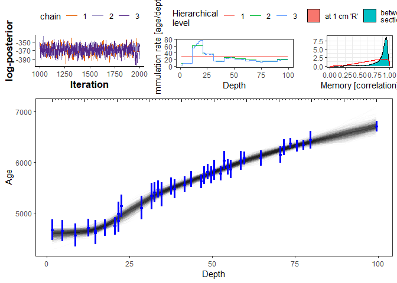
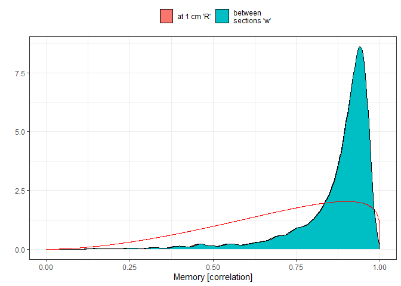
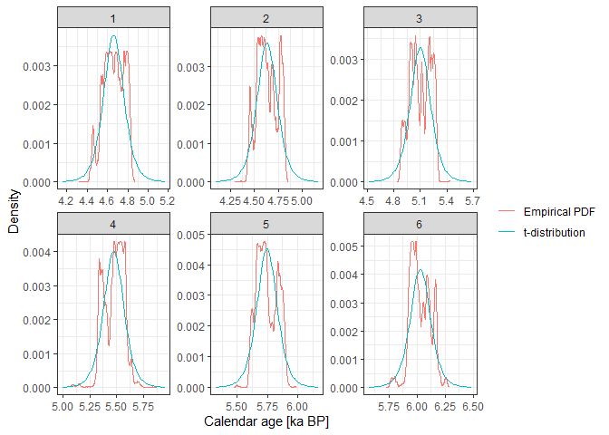
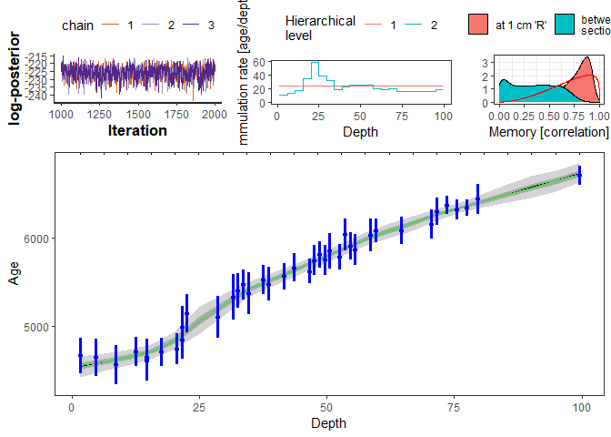

-------------------------------

**hamstr** implements a *Bacon-like* sediment accumulation or age-depth model with hierarchically structured multi-resolution sediment sections. The Bayesian model is implemented in the Stan probabilistic  programming language (https://mc-stan.org/). 


**hamstr** also includes the example data, core MSB2K, included in the existing C++ implementation of [Bacon v2.2](http://www.chrono.qub.ac.uk/blaauw/bacon.html)


The motivation for creating this package is to make use of the Bacon age modelling routine more flexible, and to make further development of the age model itself easier, by coding it in a widely used higher-level probabilistic programming language.


*  Parnell, Andrew. 2016. Bchron: Radiocarbon Dating, Age-Depth Modelling, Relative Sea Level Rate Estimation, and Non-Parametric Phase Modelling. R package version 4.2.6. https://CRAN.R-project.org/package=Bchron

*  Blaauw, Maarten, and J. Andrés Christen. 2011. Flexible Paleoclimate Age-Depth Models Using an Autoregressive Gamma Process. Bayesian Analysis 6 (3): 457-74. doi:10.1214/ba/1339616472.

*  Stan Development Team. 2016. Stan Modeling Language Users Guide and Reference Manual, Version 2.14.0.   http://mc-stan.org


## Development

We aim to develop this package following the [Guidelines for R packages providing interfaces to Stan](https://cran.r-project.org/web/packages/rstantools/vignettes/developer-guidelines.html)


## Installation

**hamstr** can be installed directly from Github


```r
if (!require("devtools")) {
  install.packages("devtools")
}

devtools::install_github("earthsystemdiagnostics/hamstr", args = "--preclean", build_vignettes = FALSE)
```


```r
library(hamstr)
library(rstan)
#> Loading required package: StanHeaders
#> rstan (Version 2.21.2, GitRev: 2e1f913d3ca3)
#> For execution on a local, multicore CPU with excess RAM we recommend calling
#> options(mc.cores = parallel::detectCores()).
#> To avoid recompilation of unchanged Stan programs, we recommend calling
#> rstan_options(auto_write = TRUE)
#> Do not specify '-march=native' in 'LOCAL_CPPFLAGS' or a Makevars file
#> 
#> Attaching package: 'rstan'
#> The following object is masked from 'package:tidyr':
#> 
#>     extract
library(tidyverse)
#> -- Attaching packages ------------------------------------------------------------ tidyverse 1.3.0 --
#> v tibble  3.0.3     v stringr 1.4.0
#> v readr   1.3.1     v forcats 0.5.0
#> v purrr   0.3.4
#> -- Conflicts --------------------------------------------------------------- tidyverse_conflicts() --
#> x rstan::extract() masks tidyr::extract()
#> x dplyr::filter()  masks stats::filter()
#> x dplyr::lag()     masks stats::lag()

set.seed(20200827)
```


A quick example using the example core "MSB2K" from the [rbacon](https://cran.r-project.org/web/packages/rbacon/index.html) package.


## Calibrate the radiocarbon ages to calendar ages.


```r
# function calibrate_14C_age will append columns to a data.frame with the 
# calendar ages and 1 sigma uncertainties
MSB2K_cal <- calibrate_14C_age(MSB2K, age.14C = "age", age.14C.se = "error")
```

#### Assign to 3 cores, one per chain, as long as the machine has at least 3


```r
if (parallel::detectCores() >= 3) options(mc.cores = 3)
```


```r
hamstr_fit_1 <- hamstr(depth = MSB2K_cal$depth,
                   obs_age = MSB2K_cal$age.14C.cal,
                   obs_err = MSB2K_cal$age.14C.cal.se,
                   shape = 1,
                   K = c(10, 10))
#> Warning: Bulk Effective Samples Size (ESS) is too low, indicating posterior means and medians may be unreliable.
#> Running the chains for more iterations may help. See
#> http://mc-stan.org/misc/warnings.html#bulk-ess
#> Warning: Tail Effective Samples Size (ESS) is too low, indicating posterior variances and tail quantiles may be unreliable.
#> Running the chains for more iterations may help. See
#> http://mc-stan.org/misc/warnings.html#tail-ess

hamstr_fit_1b <- hamstr(depth = MSB2K_cal$depth,
                   obs_age = MSB2K_cal$age.14C.cal,
                   obs_err = MSB2K_cal$age.14C.cal.se,
                   shape = 1,
                   K = c(100))
```


### Default plot


```r
plot_hamstr(hamstr_fit_1)
#> Joining, by = "idx"
#> Joining, by = "alpha_idx"
```

<!-- -->

### Plot "spaghetti" instead of shaded regions


```r
plot_hamstr(hamstr_fit_1, type = "spag")
#> Joining, by = "idx"
#> Joining, by = "alpha_idx"
```

<!-- -->

### Prior and posterior of overall mean accumulation rate


```r
plot_acc_mean_prior_posterior(hamstr_fit_1)
```

<!-- -->

### Plot modelled accumulation rates at each hierarchical level


```r
plot_hierarchical_acc_rate(hamstr_fit_1)
#> Joining, by = "alpha_idx"
```

<!-- -->


### Plot memory prior and posterior

As for this example the highest resolution sections are approximately 1 cm thick, there is not much difference between R and w. 


```r
plot_memory_prior_posterior(hamstr_fit_1)
```

<!-- -->


### Examine calendar age PDFs

Unlike Bacon, HAMStR approximates the complicated empirical calendar age PDFs with t-distributions. These can be examined with the function `compare_14C_PDF`

The six dates are plotted here.


```r
i <- seq(1, 40, by = floor(40/6))[1:6]
compare_14C_PDF(MSB2K$age[i], MSB2K$error[i])
```

<!-- -->


## Refit with fewer sections at the highest resolution


```r
hamstr_fit_2 <- hamstr(depth = MSB2K_cal$depth,
                   obs_age = MSB2K_cal$age.14C.cal,
                   obs_err = MSB2K_cal$age.14C.cal.se,
                   K = c(4, 5))
```


```r
plot_hamstr(hamstr_fit_2)
#> Joining, by = "idx"
#> Joining, by = "alpha_idx"
```

<!-- -->


## Refit with 21 non-hierarchical sections


```r
hamstr_fit_3 <- hamstr(depth = MSB2K_cal$depth,
                   obs_age = MSB2K_cal$age.14C.cal,
                   obs_err = MSB2K_cal$age.14C.cal.se,
                   K = c(21))
```


```r
plot_hamstr(hamstr_fit_3)
#> Joining, by = "idx"
#> Joining, by = "alpha_idx"
```

<!-- -->


```r
plot_hamstr(hamstr_fit_3, type = "spag")
#> Joining, by = "idx"
#> Joining, by = "alpha_idx"
```

<!-- -->
