hamstr: Hierarchical Accumulation Modelling with Stan and R.
================
Andrew M. Dolman
2021-05-08

------------------------------------------------------------------------

**hamstr** implements a *Bacon-like* (Blaauw and Christen, 2011)
sediment accumulation or age-depth model with hierarchically structured
multi-resolution sediment sections. The Bayesian model is implemented in
the Stan probabilistic programming language (<https://mc-stan.org/>).

We aim to develop this package following the [Guidelines for R packages
providing interfaces to
Stan](https://cran.r-project.org/web/packages/rstantools/vignettes/developer-guidelines.html)

### Installation

**hamstr** can be installed directly from Github

``` r
if (!require("remotes")) {
  install.packages("remotes")
}

remotes::install_github("earthsystemdiagnostics/hamstr", args = "--preclean", build_vignettes = FALSE)
```

### Using hamstr

Examples using the example core “MSB2K” from the
[rbacon](https://cran.r-project.org/web/packages/rbacon/index.html)
package.

``` r
library(hamstr)
library(rstan)
library(tidyverse)
#> Warning: package 'tibble' was built under R version 4.0.3
#> Warning: package 'readr' was built under R version 4.0.3

set.seed(20200827)
```

#### Converting radiocarbon ages to calendar ages.

Unlike Bacon, hamstr does not do the conversion of radiocarbon dates to
calendar ages as part of the model fitting process. This must be done in
advance. hamstr includes the helper function `calibrate_14C_age` to do
this, which in turn uses the function `BchronCalibrate` from the
[Bchron](https://cran.r-project.org/web/packages/Bchron/index.html)
package.

Additionally, unlike Bacon, hamstr summarises the complex empirical
calendar age PDF that results from calibration into a single point
estimate and 1-sigma uncertainty. This is a necessary compromise in
order to be able to use the power of the Stan platform. Viewed in
context with the many other uncertainties in radiocarbon dates and the
resulting age-models this will not usually be a major issue.

The function `calibrate_14C_age` will append columns to a data.frame
with the calendar ages and 1-sigma uncertainties.

``` r
MSB2K_cal <- calibrate_14C_age(MSB2K, age.14C = "age", age.14C.se = "error")
```

#### Fitting age-models with hamstr

Age-depth (sediment accumulation) models are fit with the function
`hamstr`.

By default hamstr runs with three Markov chains and these can be run in
parallel. This code will assign 3 (processor) cores as long as the
machine has at least 3.

``` r
if (parallel::detectCores() >= 3) options(mc.cores = 3)
```

The key structural difference between Bacon and hamstr models is that
with hamstr the sediment profile is modelled at multiple resolutions
with a hierarchical structure. This removes the need to trade-off
smoothness and flexibility. One of the more critical tuning parameters
in the Bacon model is the parameter `thick`, which determines the
thickness and number of discrete core sections. Finding a good or
optimal value for a given core is often critical to getting a good
age-depth model. Too few sections and the resulting age-model is very
“blocky” and can miss changes in sedimentation rate; however,
counter-intuitively, too many very thin sections can also often result
in an age-model that “under-fits” the data - ploughing a straight line
through the age-control points when a lower resolution model shows
variation in accumulation rate.

The parameter `K` controls the number and structure of the hierarchical
sections. It is specified as a vector, where each value indicates the
number of new child sections for each parent section at each finer
hierarchical level. E.g. `c(10, 10)` specifies 10 sections at the
coarsest level, with 10 new sections for each coarse section at the next
finer level, for a total of 100 sections at the highest / finest
resolution level. `c(10, 10, 10)` would specify 1000 sections at the
finest level and 3 hierarchical levels of 10, 100 and 1000 sections.

The structure is hierarchical in the sense that the accumulation rates
for the parent sections act as priors for their child sections,
specifically the mean accumulation rate for a given parent is the mean
of the gamma prior for it’s child sections. In turn, the overall mean
accumulation rate for the whole core is itself a parameter estimated by
the fitting process. The hierarchical structure of increasing resolution
allows the model to adapt to low-frequency changes in the accumulation
rate, that is changes between “regimes” of high or low accumulation that
persist for long periods, perhaps due to glacial-interglacial cycles.

By default, hamstr uses robust linear regression (`MASS::rlm`) to
estimate the mean accumulation rate from the data, and then uses this to
parametrise a prior distribution for the overall mean accumulation rate.
This prior is a half-normal with zero mean and standard deviation equal
to 10 times the estimated mean. Although this does introduce an element
of “data-peaking” or using the data twice, for both the prior and
likelihood, the resulting prior is only weakly-informative and unless
the data set is very poor, the data exert very strong control over this
parameter anyway. The advantage is that the prior is automatically
scaled appropriately regardless of the units of depth or age.

Here we fit a model with a 10, 100 section structure.

``` r
hamstr_fit_1 <- hamstr(depth = MSB2K_cal$depth,
                   obs_age = MSB2K_cal$age.14C.cal,
                   obs_err = MSB2K_cal$age.14C.cal.se,
                   K = c(10, 10))
```

The default plotting method shows the fitted age models together with
some diagnostic plots: a traceplot of the log-posterior to assess
convergence of the overall model; a plot of accumulation rate against
depth at each hierarchical level; the prior and posterior of the memory
parameter. By default the age-models are summarised to show the mean,
median, 25% and 95% posterior intervals. The data are shown as points
with their 1-sigma uncertainties. The structure of the sections is shown
along the top of the age-model plot.

``` r
plot(hamstr_fit_1)
#> Joining, by = "idx"
#> Joining, by = "alpha_idx"
```

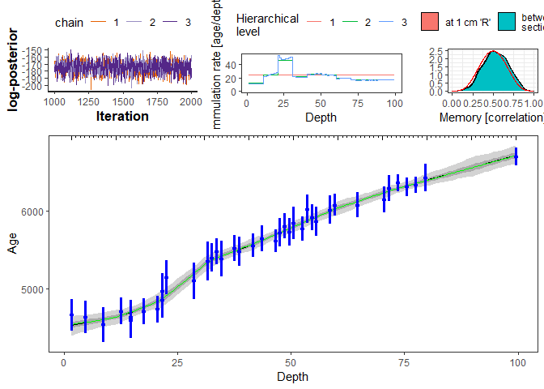<!-- -->

A “spaghetti” plot can be created instead of shaded regions. This shows
a random sample of iterations from the posterior distribution
(realisation of the age-depth model). This can be slow if lots of
iterations are plotted, the default is to plot 1000 iterations.
Additionally, plotting of the diagnostic plots can be switched off.

``` r
plot(hamstr_fit_1, summarise = FALSE, plot_diagnostics = FALSE)
#> Joining, by = "idx"
```

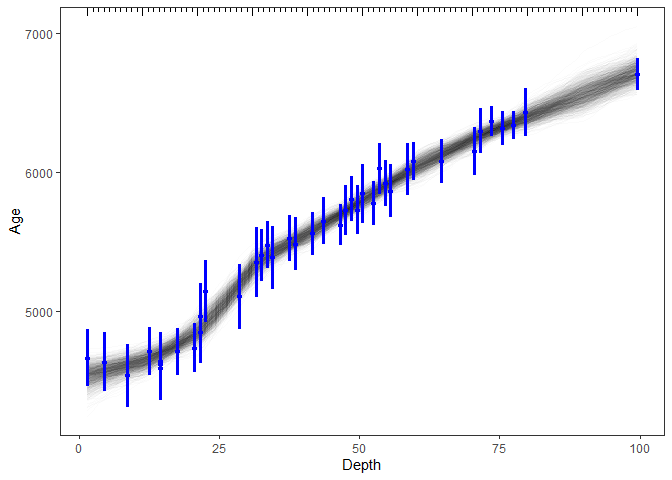<!-- -->

Additional diagnostic plots are available. A plot of the prior and
posterior distributions of the overall mean accumulation rate for
example. See ?plot.hamstr\_fit for options.

#### Prior and posterior of overall mean accumulation rate

``` r
plot(hamstr_fit_1, type = "acc_mean_prior_post")
```

<!-- -->

#### Plot modelled accumulation rates at each hierarchical level

``` r
plot(hamstr_fit_1, type = "hier_acc")
#> Joining, by = "alpha_idx"
```

<!-- -->

#### Plot memory prior and posterior

As for this example the highest resolution sections are approximately 1
cm thick, there is not much difference between R and w.

``` r
plot(hamstr_fit_1, type = "mem")
```

<!-- -->

#### Examine calendar age PDFs

As mentioned earlier, unlike Bacon, hamstr approximates the complicated
empirical calendar age PDFs with t-distributions. These can be examined
with the function `compare_14C_PDF`

A sample of six dates are plotted here.

``` r
i <- seq(1, 40, by = floor(40/6))[1:6]
compare_14C_PDF(MSB2K$age[i], MSB2K$error[i], cal_curve = "intcal20")
```

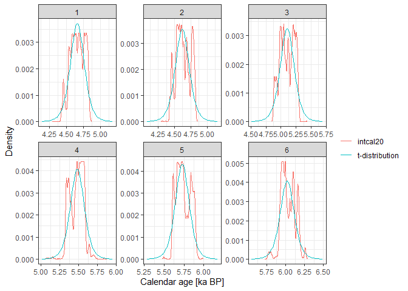<!-- -->

### Varying the number and structure of the modelled sections.

To get to approximately 100 sections at the finest level, we could have
a single level `c(100)` or at the other extreme c(2,2,2,2,2,2,2), which
would result in 2^7 = 128 sections.

There is a trade-off between these two approaches. Having the maximum
number of hierarchical levels maximises the ultimate flexibility of the
model, but comes at a cost of computation time and model stability. More
hierarchical levels means that more parameters are ultimately being
estimated to end up with the same number at the finest level. For
example, `c(10, 10)` results in 110 fine sections but 110 accumulation
rates are estimated. `c(2, 2, 2, 2, 2, 2, 2)` results in 128 sections
but 254 parameters are estimated. However, more importantly, having
fewer child sections means that less information is being used “pooled”
to estimate the parent section mean. Each parameter is estimated with
less certainty and therefore is a less informative prior for its child
sections. This makes sampling the posterior distribution more difficult,
slower, and less stable. The optimal structure will likely depend on the
given dataset and optimising this is under investigation, but
hierarchical levels of about 10 seem to work well.

Here we compare a 2^7 structure with a single level of 128 sections.

``` r
hamstr_fit_2pow7 <- hamstr(depth = MSB2K_cal$depth,
                   obs_age = MSB2K_cal$age.14C.cal,
                   obs_err = MSB2K_cal$age.14C.cal.se,
                   K = c(2, 2, 2, 2, 2, 2, 2))
#> Warning: Bulk Effective Samples Size (ESS) is too low, indicating posterior means and medians may be unreliable.
#> Running the chains for more iterations may help. See
#> http://mc-stan.org/misc/warnings.html#bulk-ess
#> Warning: Tail Effective Samples Size (ESS) is too low, indicating posterior variances and tail quantiles may be unreliable.
#> Running the chains for more iterations may help. See
#> http://mc-stan.org/misc/warnings.html#tail-ess

hamstr_fit_5pow3 <- hamstr(depth = MSB2K_cal$depth,
                   obs_age = MSB2K_cal$age.14C.cal,
                   obs_err = MSB2K_cal$age.14C.cal.se,
                   K = c(5,5,5))

hamstr_fit_128 <- hamstr(depth = MSB2K_cal$depth,
                   obs_age = MSB2K_cal$age.14C.cal,
                   obs_err = MSB2K_cal$age.14C.cal.se,
                   K = c(128))
```

``` r
rstan::get_elapsed_time(hamstr_fit_2pow7$fit)
#>         warmup sample
#> chain:1 16.377  8.657
#> chain:2 16.666  8.627
#> chain:3 16.486 10.367
rstan::get_elapsed_time(hamstr_fit_5pow3$fit)
#>         warmup sample
#> chain:1  4.894  2.809
#> chain:2  5.113  2.772
#> chain:3  5.373  2.778
rstan::get_elapsed_time(hamstr_fit_128$fit)
#>         warmup sample
#> chain:1  4.637  4.815
#> chain:2  4.757  4.716
#> chain:3  4.971  4.829
```

``` r
plot(hamstr_fit_2pow7)
#> Joining, by = "idx"
#> Joining, by = "alpha_idx"
```

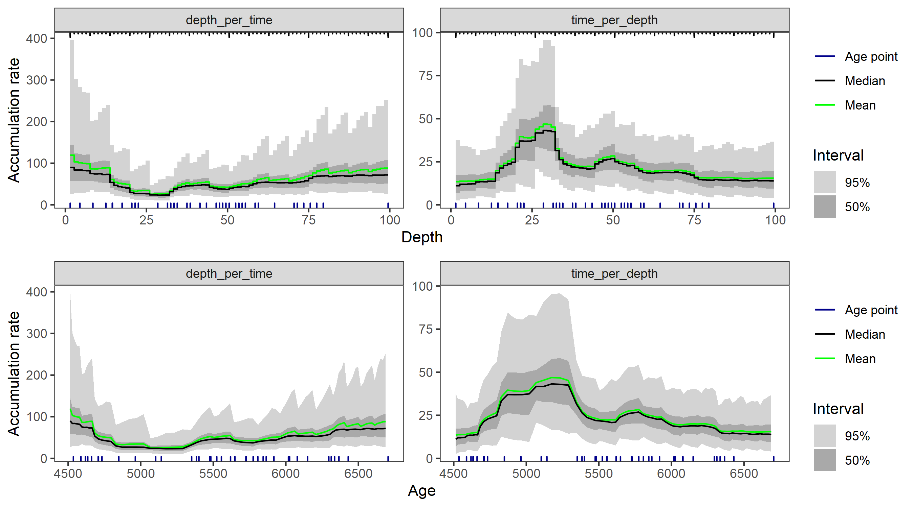<!-- -->

``` r
plot(hamstr_fit_5pow3)
#> Joining, by = "idx"
#> Joining, by = "alpha_idx"
```

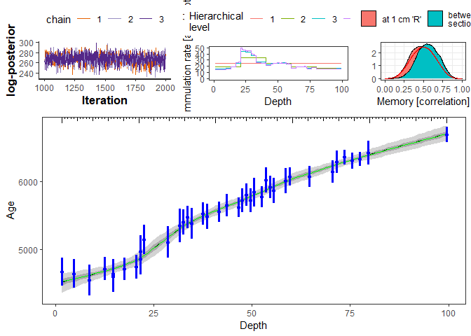<!-- -->

``` r
plot(hamstr_fit_128)
#> Joining, by = "idx"
#> Joining, by = "alpha_idx"
```

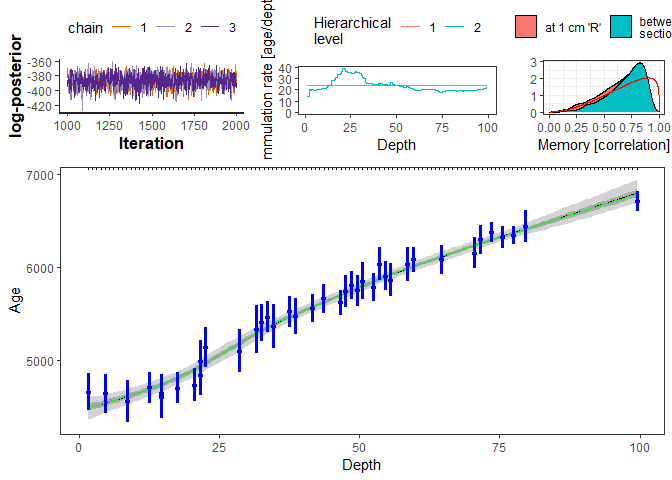<!-- -->

#### Refit with 21 non-hierarchical sections for comparison with figures in Blaauw and Christen (2011)

``` r
hamstr_fit_21 <- hamstr(depth = MSB2K_cal$depth,
                   obs_age = MSB2K_cal$age.14C.cal,
                   obs_err = MSB2K_cal$age.14C.cal.se,
                   K = c(21))
```

``` r
plot(hamstr_fit_21, summarise = FALSE)
#> Joining, by = "idx"
#> Joining, by = "alpha_idx"
```

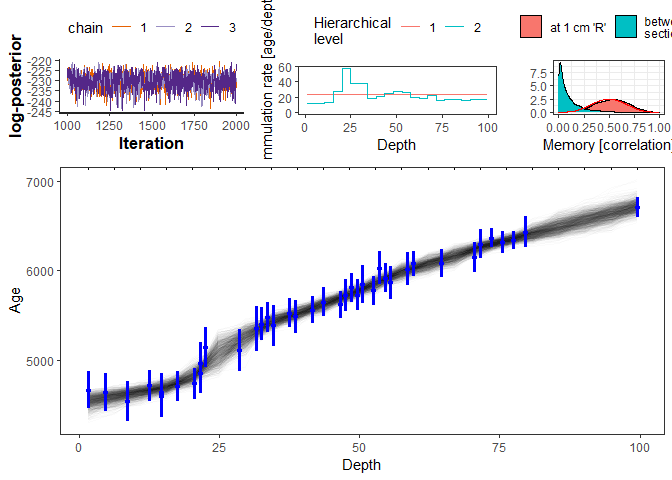<!-- -->

### Convenience functions

#### Extracting the age models

`get_posterior_ages` extracts all iterations (realisations) of the
age-depth model

``` r
age.mods <- get_posterior_ages(hamstr_fit_5pow3)
#> Joining, by = "idx"
age.mods
#> # A tibble: 378,000 x 5
#>     iter par      age   idx depth
#>    <int> <chr>  <dbl> <dbl> <dbl>
#>  1     1 c_ages 4541.     1  1.5 
#>  2     1 c_ages 4550.     2  2.28
#>  3     1 c_ages 4559.     3  3.07
#>  4     1 c_ages 4570.     4  3.85
#>  5     1 c_ages 4580.     5  4.64
#>  6     1 c_ages 4590.     6  5.42
#>  7     1 c_ages 4599.     7  6.20
#>  8     1 c_ages 4608.     8  6.99
#>  9     1 c_ages 4616.     9  7.77
#> 10     1 c_ages 4624.    10  8.56
#> # ... with 377,990 more rows
```

The hierarchical structure of the sections makes it difficult to specify
the exact depth resolution that you want for your resulting age-depth
model. The function `interpolate_age_models` makes it easier to
interpolate to a specific set of depths. The function returns NA for
depths that are outside the modelled depths.

``` r
age.mods.interp <- predict(hamstr_fit_5pow3,
                           new_depth = seq(0, 100, by = 1))
#> Joining, by = "idx"
```

These interpolated age models can summarised with the same function as
the original fitted objects, but the n\_eff and Rhat information is
lost.

``` r
summary(hamstr_fit_5pow3)
#> Joining, by = "idx"
#> # A tibble: 126 x 13
#>    depth   idx par    mean se_mean    sd `2.5%` `25%` `50%` `75%` `97.5%` n_eff
#>    <dbl> <dbl> <chr> <dbl>   <dbl> <dbl>  <dbl> <dbl> <dbl> <dbl>   <dbl> <dbl>
#>  1  1.5      1 c_ag~ 4513.    3.04  68.7  4363. 4468. 4518. 4562.   4634.  510.
#>  2  2.28     2 c_ag~ 4523.    2.90  65.4  4382. 4481. 4527. 4570.   4640.  507.
#>  3  3.07     3 c_ag~ 4534.    2.77  62.4  4400. 4493. 4537. 4579.   4646.  509.
#>  4  3.85     4 c_ag~ 4544.    2.63  59.7  4416. 4505. 4548. 4587.   4652.  515.
#>  5  4.64     5 c_ag~ 4555.    2.49  57.3  4435. 4518. 4557. 4597.   4659.  530.
#>  6  5.42     6 c_ag~ 4566.    2.36  55.4  4452. 4529. 4567. 4606.   4669.  551.
#>  7  6.20     7 c_ag~ 4577.    2.22  53.3  4466. 4542. 4578. 4615.   4676.  576.
#>  8  6.99     8 c_ag~ 4588.    2.08  51.1  4483. 4555. 4590. 4624.   4684.  607.
#>  9  7.77     9 c_ag~ 4600.    1.92  49.0  4501. 4568. 4602. 4634.   4692.  649.
#> 10  8.56    10 c_ag~ 4612.    1.76  46.9  4516. 4582. 4613. 4644.   4701.  709.
#> # ... with 116 more rows, and 1 more variable: Rhat <dbl>
```

``` r
summary(age.mods.interp)
#> # A tibble: 101 x 8
#>    depth  mean    sd `2.5%` `25%` `50%` `75%` `97.5%`
#>    <dbl> <dbl> <dbl>  <dbl> <dbl> <dbl> <dbl>   <dbl>
#>  1     0   NA   NA      NA    NA    NA    NA      NA 
#>  2     1   NA   NA      NA    NA    NA    NA      NA 
#>  3     2 4520.  66.5  4375. 4476. 4524. 4567.   4637.
#>  4     3 4533.  62.6  4398. 4492. 4536. 4578.   4646.
#>  5     4 4546.  59.2  4419. 4508. 4549. 4589.   4653.
#>  6     5 4560.  56.4  4444. 4523. 4562. 4601.   4663.
#>  7     6 4574.  53.8  4462. 4539. 4575. 4612.   4673.
#>  8     7 4589.  51.1  4483. 4556. 4590. 4624.   4684.
#>  9     8 4604.  48.3  4505. 4573. 4605. 4637.   4695.
#> 10     9 4619.  45.9  4525. 4589. 4620. 4650.   4706.
#> # ... with 91 more rows
```

Within the hamstr\_fit object is an rstan object on which all the
standard rstan functions should operate correctly.

``` r
rstan::check_divergences(hamstr_fit_5pow3$fit)
#> 0 of 3000 iterations ended with a divergence.

rstan::stan_rhat(hamstr_fit_5pow3$fit)
#> `stat_bin()` using `bins = 30`. Pick better value with `binwidth`.
#> Warning: Removed 3 rows containing non-finite values (stat_bin).
```

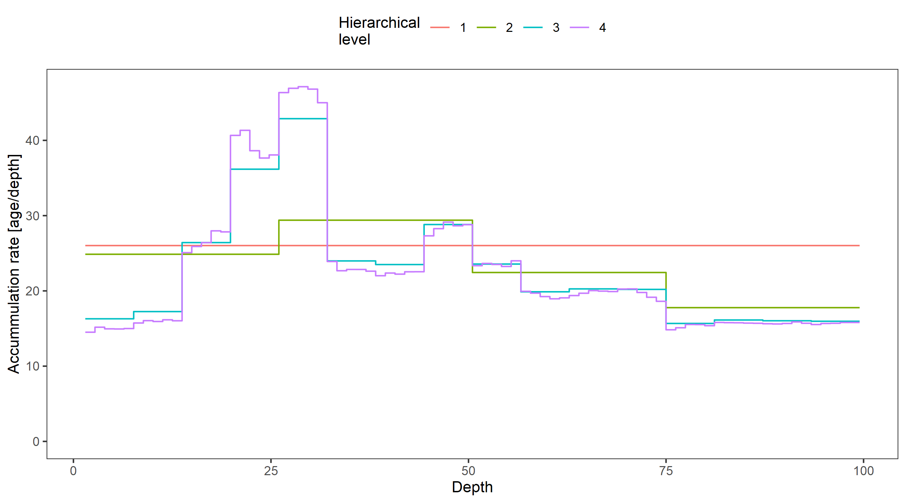<!-- -->

The first `alpha` parameter is the overall mean accumulation rate.

``` r
rstan::traceplot(hamstr_fit_5pow3$fit, par = c("alpha[1]"),
                 inc_warmup = TRUE)
```

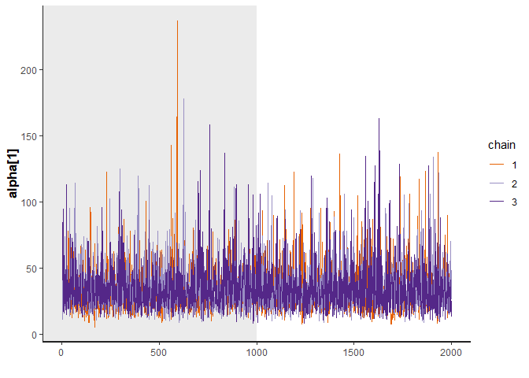<!-- -->

`alpha[2]` to `alpha[6]` will be the first hierarchical level of 5 rates
for this model.

``` r
plot(hamstr_fit_5pow3, type = "hier")
#> Joining, by = "alpha_idx"
```

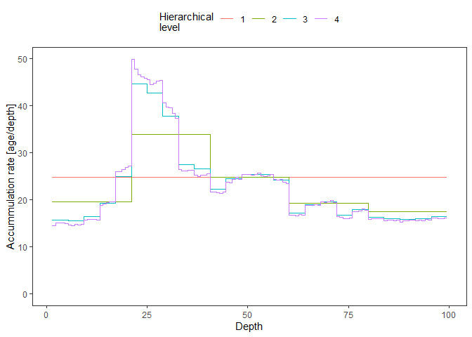<!-- -->

``` r
rstan::traceplot(hamstr_fit_5pow3$fit, par = paste0("alpha[", 2:6, "]"),
                 inc_warmup = TRUE)
```

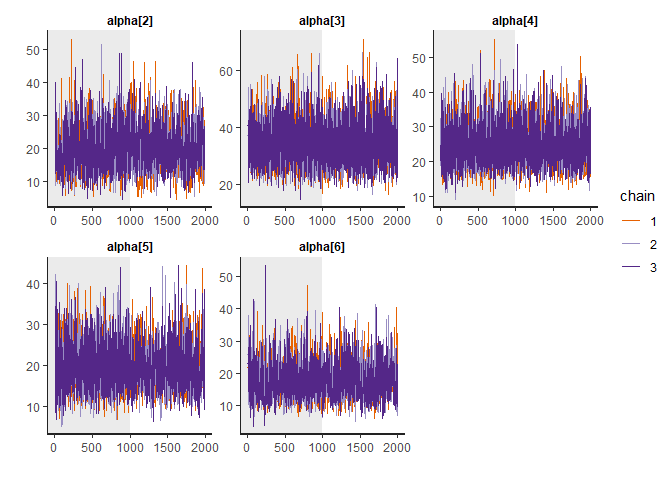<!-- -->

### References

-   Blaauw, Maarten, and J. Andrés Christen. 2011. Flexible Paleoclimate
    Age-Depth Models Using an Autoregressive Gamma Process. Bayesian
    Analysis 6 (3): 457-74. <doi:10.1214/ba/1339616472>.

-   Parnell, Andrew. 2016. Bchron: Radiocarbon Dating, Age-Depth
    Modelling, Relative Sea Level Rate Estimation, and Non-Parametric
    Phase Modelling. R package version 4.2.6.
    <https://CRAN.R-project.org/package=Bchron>

-   Stan Development Team (2020). RStan: the R interface to Stan. R
    package version 2.21.2. <http://mc-stan.org/>.
