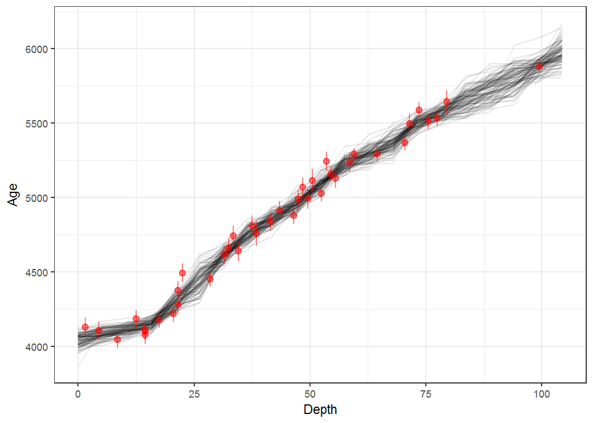

# baconr: An rstan implementation of the Bayesian Age-Depth model *Bacon* (Blaauw and Christen, 2011).
Andrew M. Dolman  
`r Sys.Date()`  


```r
library(tidyverse)
library(baconr)
library(knitr)

opts_chunk$set(echo=TRUE, message = FALSE, warning = FALSE, cache = TRUE,
               fig.width = 7, fig.pos = "H", dpi = 150, autodep = TRUE)
```


```r
# Get number of sections K, so that they will be ~ 5cm
K_for_5cm <- round(diff(range(MSB2K$depth)) / 5)

make_stan_dat(depth = MSB2K$depth, 
  obs_age = MSB2K$age, 
  obs_err = MSB2K$error,
  K = K_for_5cm, nu = 6,
  acc_mean = 20, acc_var = "default",
  mem_mean = 0.7, mem_strength = 4)
```

```
## $depth
##  [1]  1.5  4.5  8.5 12.5 14.5 14.5 14.5 17.5 20.5 21.5 21.5 22.5 28.5 31.5
## [15] 32.5 33.5 34.5 37.5 38.5 41.5 43.5 46.5 47.5 48.5 49.5 50.5 52.5 53.5
## [29] 54.5 55.5 58.5 59.5 64.5 70.5 71.5 73.5 75.5 77.5 79.5 99.5
## 
## $obs_age
##  [1] 4128 4106 4046 4184 4076 4107 4097 4177 4220 4281 4374 4493 4452 4616
## [15] 4662 4743 4638 4810 4757 4839 4913 4880 4989 5070 4993 5115 5026 5242
## [29] 5159 5130 5238 5293 5293 5368 5498 5588 5514 5535 5644 5885
## 
## $obs_err
##  [1] 65 60 59 58 62 61 58 53 59 64 64 62 52 64 64 67 67 67 82 59 65 57 70
## [24] 66 67 79 51 64 50 66 65 38 54 51 69 55 57 52 77 45
## 
## $K
## [1] 20
## 
## $nu
## [1] 6
## 
## $acc_mean
## [1] 20
## 
## $acc_var
## [1] 266.6667
## 
## $mem_mean
## [1] 0.7
## 
## $mem_strength
## [1] 4
## 
## $N
## [1] 40
## 
## $mem_alpha
## [1] 2.8
## 
## $mem_beta
## [1] 1.2
## 
## $c
##  [1]  1  2  3  4  5  6  7  8  9 10 11 12 13 14 15 16 17 18 19 20
## 
## $delta_c
## [1] 5.22
## 
## $c_depth_bottom
##  [1]   5.22  10.44  15.66  20.88  26.10  31.32  36.54  41.76  46.98  52.20
## [11]  57.42  62.64  67.86  73.08  78.30  83.52  88.74  93.96  99.18 104.40
## 
## $c_depth_top
##  [1]  0.00  5.22 10.44 15.66 20.88 26.10 31.32 36.54 41.76 46.98 52.20
## [12] 57.42 62.64 67.86 73.08 78.30 83.52 88.74 93.96 99.18
## 
## $which_c
##  [1]  1  1  2  3  3  3  3  4  4  5  5  5  6  7  7  7  7  8  8  8  9  9 10
## [24] 10 10 10 11 11 11 11 12 12 13 14 14 15 15 15 16 20
```


```r
system.time(
fit <- stan_bacon(
  depth = MSB2K$depth, 
  obs_age = MSB2K$age, 
  obs_err = MSB2K$error,
  K = K_for_5cm, nu = 6,
  acc_mean = 20, acc_var = "default",
  mem_mean = 0.7, mem_strength = 4,
  iter = 2000, chains = 4)
)
```

```
## 
## SAMPLING FOR MODEL 'bacon' NOW (CHAIN 1).
## 
## Chain 1, Iteration:    1 / 2000 [  0%]  (Warmup)
## Chain 1, Iteration:  200 / 2000 [ 10%]  (Warmup)
## Chain 1, Iteration:  400 / 2000 [ 20%]  (Warmup)
## Chain 1, Iteration:  600 / 2000 [ 30%]  (Warmup)
## Chain 1, Iteration:  800 / 2000 [ 40%]  (Warmup)
## Chain 1, Iteration: 1000 / 2000 [ 50%]  (Warmup)
## Chain 1, Iteration: 1001 / 2000 [ 50%]  (Sampling)
## Chain 1, Iteration: 1200 / 2000 [ 60%]  (Sampling)
## Chain 1, Iteration: 1400 / 2000 [ 70%]  (Sampling)
## Chain 1, Iteration: 1600 / 2000 [ 80%]  (Sampling)
## Chain 1, Iteration: 1800 / 2000 [ 90%]  (Sampling)
## Chain 1, Iteration: 2000 / 2000 [100%]  (Sampling)
##  Elapsed Time: 1.452 seconds (Warm-up)
##                0.94 seconds (Sampling)
##                2.392 seconds (Total)
## 
## 
## SAMPLING FOR MODEL 'bacon' NOW (CHAIN 2).
## 
## Chain 2, Iteration:    1 / 2000 [  0%]  (Warmup)
## Chain 2, Iteration:  200 / 2000 [ 10%]  (Warmup)
## Chain 2, Iteration:  400 / 2000 [ 20%]  (Warmup)
## Chain 2, Iteration:  600 / 2000 [ 30%]  (Warmup)
## Chain 2, Iteration:  800 / 2000 [ 40%]  (Warmup)
## Chain 2, Iteration: 1000 / 2000 [ 50%]  (Warmup)
## Chain 2, Iteration: 1001 / 2000 [ 50%]  (Sampling)
## Chain 2, Iteration: 1200 / 2000 [ 60%]  (Sampling)
## Chain 2, Iteration: 1400 / 2000 [ 70%]  (Sampling)
## Chain 2, Iteration: 1600 / 2000 [ 80%]  (Sampling)
## Chain 2, Iteration: 1800 / 2000 [ 90%]  (Sampling)
## Chain 2, Iteration: 2000 / 2000 [100%]  (Sampling)
##  Elapsed Time: 1.484 seconds (Warm-up)
##                0.693 seconds (Sampling)
##                2.177 seconds (Total)
## 
## 
## SAMPLING FOR MODEL 'bacon' NOW (CHAIN 3).
## 
## Chain 3, Iteration:    1 / 2000 [  0%]  (Warmup)
## Chain 3, Iteration:  200 / 2000 [ 10%]  (Warmup)
## Chain 3, Iteration:  400 / 2000 [ 20%]  (Warmup)
## Chain 3, Iteration:  600 / 2000 [ 30%]  (Warmup)
## Chain 3, Iteration:  800 / 2000 [ 40%]  (Warmup)
## Chain 3, Iteration: 1000 / 2000 [ 50%]  (Warmup)
## Chain 3, Iteration: 1001 / 2000 [ 50%]  (Sampling)
## Chain 3, Iteration: 1200 / 2000 [ 60%]  (Sampling)
## Chain 3, Iteration: 1400 / 2000 [ 70%]  (Sampling)
## Chain 3, Iteration: 1600 / 2000 [ 80%]  (Sampling)
## Chain 3, Iteration: 1800 / 2000 [ 90%]  (Sampling)
## Chain 3, Iteration: 2000 / 2000 [100%]  (Sampling)
##  Elapsed Time: 1.504 seconds (Warm-up)
##                1.099 seconds (Sampling)
##                2.603 seconds (Total)
## 
## 
## SAMPLING FOR MODEL 'bacon' NOW (CHAIN 4).
## 
## Chain 4, Iteration:    1 / 2000 [  0%]  (Warmup)
## Chain 4, Iteration:  200 / 2000 [ 10%]  (Warmup)
## Chain 4, Iteration:  400 / 2000 [ 20%]  (Warmup)
## Chain 4, Iteration:  600 / 2000 [ 30%]  (Warmup)
## Chain 4, Iteration:  800 / 2000 [ 40%]  (Warmup)
## Chain 4, Iteration: 1000 / 2000 [ 50%]  (Warmup)
## Chain 4, Iteration: 1001 / 2000 [ 50%]  (Sampling)
## Chain 4, Iteration: 1200 / 2000 [ 60%]  (Sampling)
## Chain 4, Iteration: 1400 / 2000 [ 70%]  (Sampling)
## Chain 4, Iteration: 1600 / 2000 [ 80%]  (Sampling)
## Chain 4, Iteration: 1800 / 2000 [ 90%]  (Sampling)
## Chain 4, Iteration: 2000 / 2000 [100%]  (Sampling)
##  Elapsed Time: 1.438 seconds (Warm-up)
##                0.973 seconds (Sampling)
##                2.411 seconds (Total)
```

```
##    user  system elapsed 
##    9.78    0.01    9.80
```


```r
print(fit$fit, par = c("c_ages"))
```

```
## Inference for Stan model: bacon.
## 4 chains, each with iter=2000; warmup=1000; thin=1; 
## post-warmup draws per chain=1000, total post-warmup draws=4000.
## 
##               mean se_mean    sd    2.5%     25%     50%     75%   97.5%
## c_ages[1]  4040.63    0.66 38.23 3958.38 4016.92 4043.06 4067.58 4109.31
## c_ages[2]  4079.38    0.49 30.81 4018.55 4058.86 4079.91 4100.37 4136.87
## c_ages[3]  4111.24    0.45 28.64 4055.57 4091.26 4111.38 4130.99 4166.20
## c_ages[4]  4149.42    0.45 28.68 4095.76 4129.46 4148.35 4168.11 4209.39
## c_ages[5]  4294.44    0.63 39.72 4217.37 4267.37 4294.00 4320.71 4372.73
## c_ages[6]  4433.56    1.16 70.10 4306.68 4381.97 4430.53 4480.84 4577.40
## c_ages[7]  4607.10    0.65 40.99 4523.87 4580.42 4607.92 4634.79 4684.77
## c_ages[8]  4753.34    0.77 44.49 4663.24 4723.66 4755.06 4783.79 4836.70
## c_ages[9]  4855.14    0.61 38.77 4781.16 4829.47 4854.18 4880.97 4931.38
## c_ages[10] 4961.54    0.60 37.86 4891.40 4935.31 4961.14 4986.42 5038.10
## c_ages[11] 5093.35    0.70 40.96 5014.75 5065.08 5091.98 5120.18 5175.59
## c_ages[12] 5226.62    0.55 34.59 5155.06 5204.32 5228.04 5251.27 5290.12
## c_ages[13] 5299.47    0.61 38.59 5226.97 5273.35 5298.62 5323.94 5380.34
## c_ages[14] 5368.89    0.81 47.10 5281.68 5336.01 5366.35 5399.72 5465.33
## c_ages[15] 5500.07    0.60 37.63 5422.72 5475.83 5502.43 5526.08 5569.22
## c_ages[16] 5571.08    0.58 36.63 5504.00 5546.40 5569.11 5594.70 5647.86
## c_ages[17] 5655.54    0.96 60.40 5550.50 5612.21 5651.99 5695.10 5781.85
## c_ages[18] 5734.16    1.05 66.68 5608.21 5687.31 5733.84 5780.00 5867.45
## c_ages[19] 5809.66    1.00 63.13 5678.78 5768.11 5812.42 5853.86 5925.79
## c_ages[20] 5885.96    0.76 47.95 5796.02 5855.38 5884.45 5913.72 5985.82
## c_ages[21] 5989.73    1.48 93.71 5846.46 5927.16 5975.11 6033.78 6219.20
##            n_eff Rhat
## c_ages[1]   3337    1
## c_ages[2]   4000    1
## c_ages[3]   4000    1
## c_ages[4]   4000    1
## c_ages[5]   4000    1
## c_ages[6]   3640    1
## c_ages[7]   4000    1
## c_ages[8]   3324    1
## c_ages[9]   4000    1
## c_ages[10]  4000    1
## c_ages[11]  3470    1
## c_ages[12]  4000    1
## c_ages[13]  4000    1
## c_ages[14]  3371    1
## c_ages[15]  4000    1
## c_ages[16]  4000    1
## c_ages[17]  4000    1
## c_ages[18]  4000    1
## c_ages[19]  4000    1
## c_ages[20]  4000    1
## c_ages[21]  4000    1
## 
## Samples were drawn using NUTS(diag_e) at Wed Apr 05 12:03:25 2017.
## For each parameter, n_eff is a crude measure of effective sample size,
## and Rhat is the potential scale reduction factor on split chains (at 
## convergence, Rhat=1).
```


```r
plot_stan_bacon(fit, 100)
```

<!-- -->

