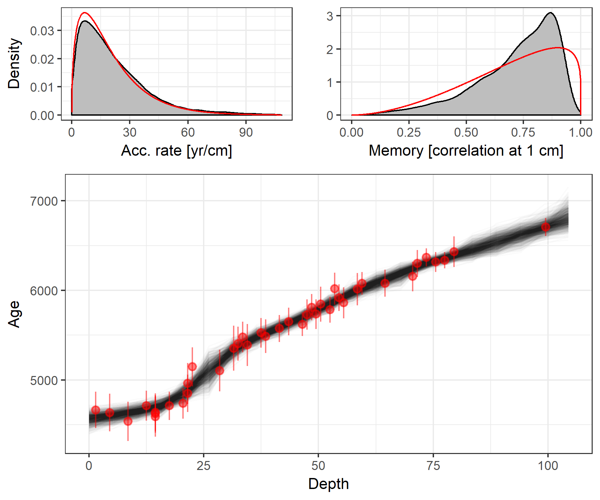
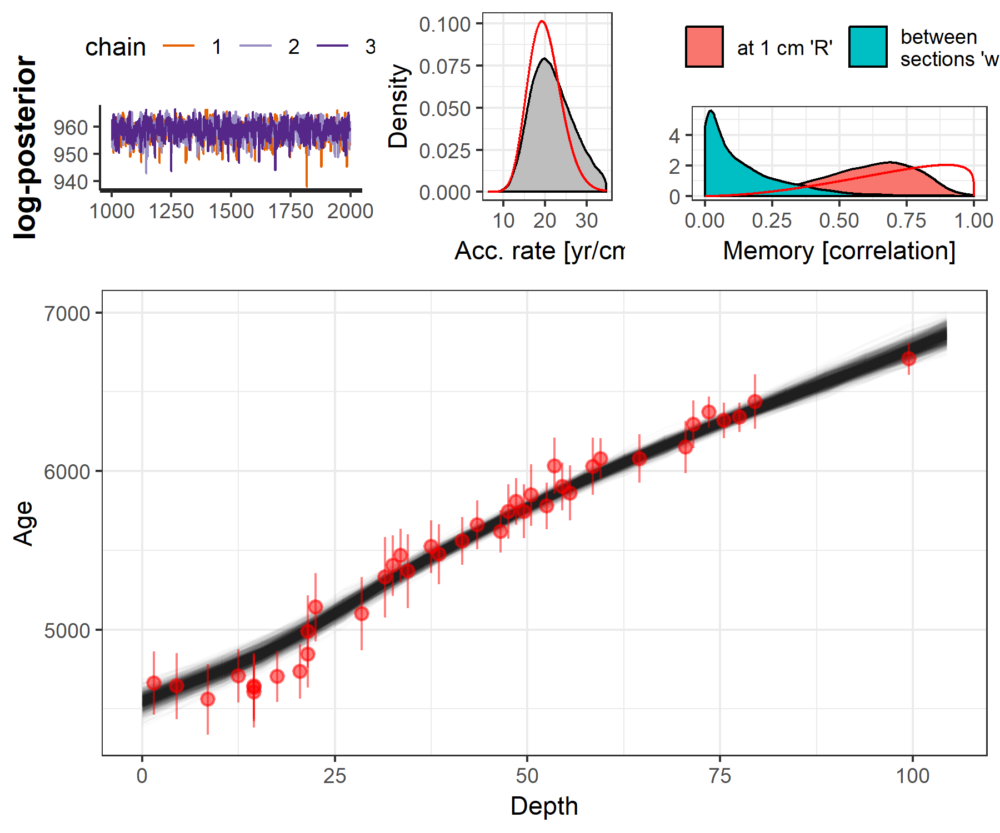
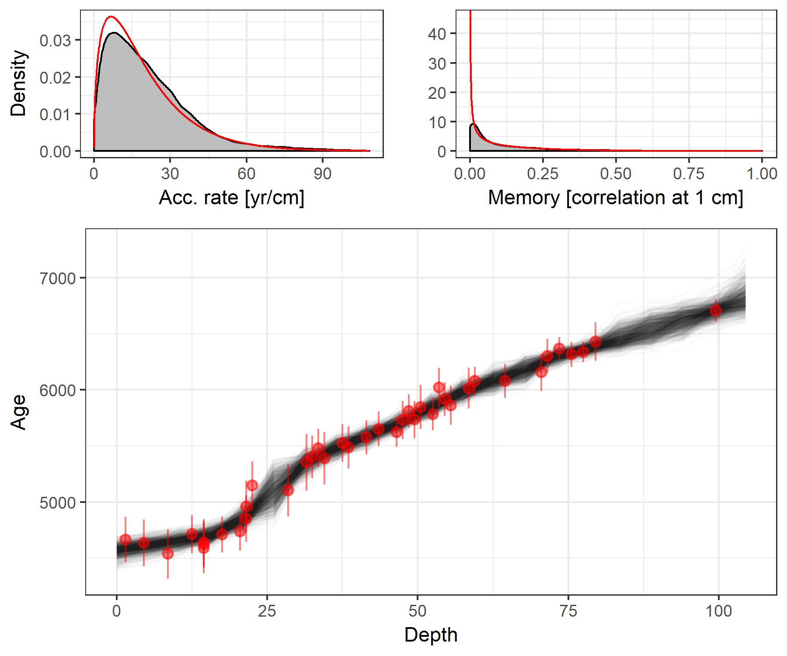
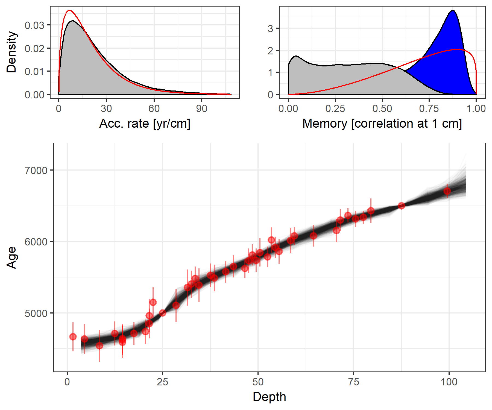
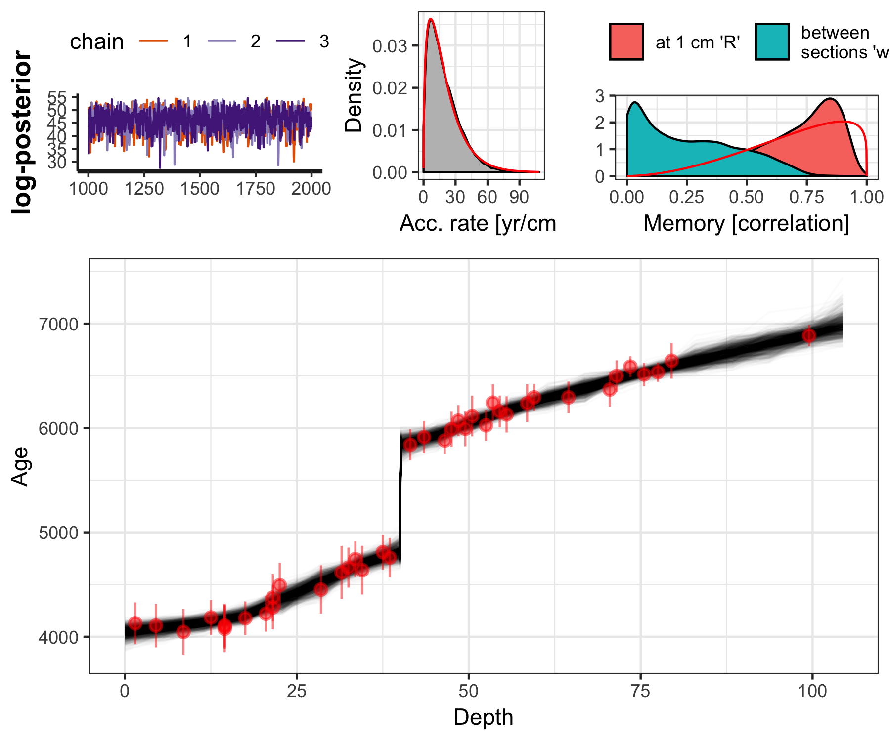
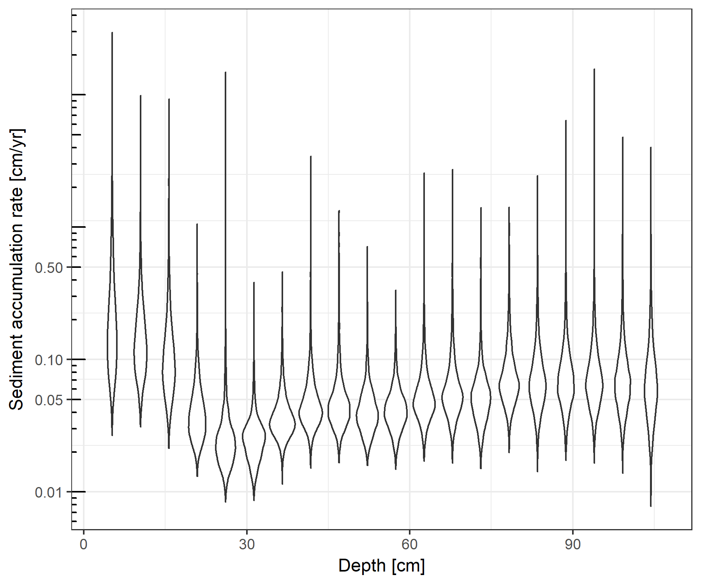
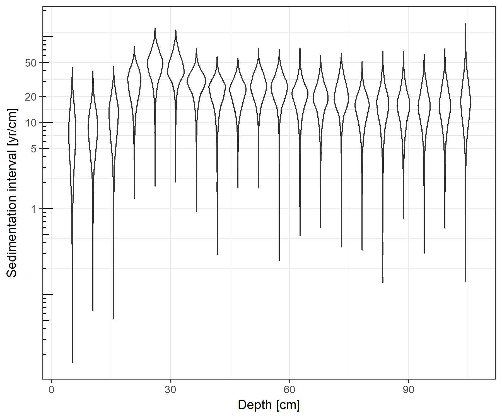

-------------------------------

**baconr** implements the Bayesian Age~Depth model, **Bacon**, in the **Stan** probabilistic programming language. It is at a very early stage of development and at the moment implements only the core non-Gaussian AR1 model described in Blaauw and Christen (2011). Functions from the R package **Bchron** (Parnell 2016) can be used to calibrate ^14^C ages to calendar ages.


There are currently just three exported functions: 

* `make_stan_dat` prepares data and parameter values into the correct format to be passed to the Stan model 
* `stan_bacon` calls a pre-compiled Stan implementation of Bacon and estimates the age model
* `plot_stan_bacon` plots a sample from the posterior distribution of the estimated age model

**baconr** also includes the example data, core MSB2K, included in the existing C++ implementation of [Bacon v2.2](http://www.chrono.qub.ac.uk/blaauw/bacon.html)

The motivation for creating this package is to make use of the Bacon age modelling routine more flexible, and to make further development 
of the age model itself easier, by coding it in a widely used higher-level probabilistic programming language.


*  Parnell, Andrew. 2016. Bchron: Radiocarbon Dating, Age-Depth Modelling, Relative Sea Level Rate Estimation, and Non-Parametric Phase Modelling. R package version 4.2.6. https://CRAN.R-project.org/package=Bchron

*  Blaauw, Maarten, and J. Andrés Christen. 2011. Flexible Paleoclimate Age-Depth Models Using an Autoregressive Gamma Process. Bayesian Analysis 6 (3): 457-74. doi:10.1214/ba/1339616472.

*  Stan Development Team. 2016. Stan Modeling Language Users Guide and Reference Manual, Version 2.14.0.   http://mc-stan.org


## Installation

**baconr** can be installed directly from Github


```r
if (!require("devtools")) {
  install.packages("devtools")
}

devtools::install_github("andrewdolman/baconr", args = "--preclean", build_vignettes = FALSE)
```


## Development

We aim to develop this package following the [Guidelines for R packages providing interfaces to Stan](https://cran.r-project.org/web/packages/rstantools/vignettes/developer-guidelines.html)


## Example


```r
library(baconr)
library(knitr)
library(ggplot2)
library(tidyr)
library(dplyr)
library(Bchron)

opts_chunk$set(echo=TRUE, message = FALSE, warning = FALSE, cache = TRUE,
               fig.width = 6, fig.pos = "H", dpi = 300, autodep = TRUE)
```

### Data and parameters

First convert 14^C ages to calendar ages. Functions from the R package **Bchron** can be used for this.


```r
cal.ages <- Bchron::BchronCalibrate(ages=MSB2K$age,
                            ageSds=MSB2K$error,
                            calCurves=rep("intcal13", nrow(MSB2K)),
                            ids=paste0("Date-", 1:nrow(MSB2K)))

SimplifyCalAge <- function(ages, densities){
  
  wts <- densities #/ sum(densities)
  
  M <- sum(wts > 0)

  w.mean <- sum(ages * wts)
  w.std <- sqrt(sum(wts * (ages-w.mean)^2) / ((M-1)/M * sum(wts)))
  
  return(c("mean" = w.mean, "std" = w.std))
  
}


MSB2K$age.cal <- sapply(cal.ages, function(x) SimplifyCalAge(x$ageGrid, x$densities)["mean"])
MSB2K$age.cal.sd <- sapply(cal.ages, function(x) SimplifyCalAge(x$ageGrid, x$densities)["std"])
```


the output from `make_stan_dat` is shown here to illustrate the required data and parameter format, but a separate call to `make_stan_dat` is not normally necessary as it is used internally by `stan_bacon`


```r
# Get number of sections K, so that they will be ~ 5cm
K_for_5cm <- round(diff(range(MSB2K$depth)) / 5)

stan_dat <- make_stan_dat(depth = MSB2K$depth, 
  obs_age = MSB2K$age.cal, 
  obs_err = MSB2K$age.cal.sd,
  K = K_for_5cm, nu = 6,
  acc_mean = 20, acc_alpha = 1.5,
  mem_mean = 0.7, mem_strength = 4)

stan_dat
```

```
## $depth
##  [1]  1.5  4.5  8.5 12.5 14.5 14.5 14.5 17.5 20.5 21.5 21.5 22.5 28.5 31.5
## [15] 32.5 33.5 34.5 37.5 38.5 41.5 43.5 46.5 47.5 48.5 49.5 50.5 52.5 53.5
## [29] 54.5 55.5 58.5 59.5 64.5 70.5 71.5 73.5 75.5 77.5 79.5 99.5
## 
## $obs_age
##  [1] 4657.561 4640.774 4557.980 4706.825 4605.683 4641.465 4631.377
##  [8] 4702.973 4735.884 4841.576 4985.491 5139.502 5100.229 5326.643
## [15] 5401.613 5462.022 5365.972 5519.758 5469.320 5557.653 5659.154
## [22] 5618.116 5740.721 5804.661 5743.650 5846.487 5779.288 6031.572
## [29] 5902.367 5859.592 6027.022 6077.651 6076.728 6149.341 6292.501
## [36] 6370.590 6315.250 6334.342 6434.404 6704.320
## 
## $obs_err
##  [1] 100.35379 104.19657 110.61316  83.47491 112.47219 104.40464 105.84736
##  [8]  80.37288  85.65684 105.23004 113.69679 108.04903 115.91231 127.35255
## [15]  95.89254  84.69436 116.73237  83.34412  94.70521  74.90965  77.48394
## [22]  66.46865  85.81377  74.35528  84.30117  97.52590  73.57604  88.57285
## [29]  75.77414  86.66675  90.19801  64.11753  76.07235  81.86930  75.30433
## [36]  49.61691  56.32650  45.93770  85.36823  50.93843
## 
## $hiatus_depth
## NULL
## 
## $hiatus_length
## NULL
## 
## $hiatus_shape
## [1] 1
## 
## $hiatus_interval
## [1] 0.1
## 
## $K
## [1] 20
## 
## $nu
## [1] 6
## 
## $acc_mean
## [1] 20
## 
## $acc_alpha
## [1] 1.5
## 
## $mem_mean
## [1] 0.7
## 
## $mem_strength
## [1] 4
## 
## $N
## [1] 40
## 
## $acc_beta
## [1] 0.075
## 
## $mem_alpha
## [1] 2.8
## 
## $mem_beta
## [1] 1.2
## 
## $c
##  [1]  1  2  3  4  5  6  7  8  9 10 11 12 13 14 15 16 17 18 19 20
## 
## $delta_c
## [1] 5.22
## 
## $c_depth_bottom
##  [1]   5.22  10.44  15.66  20.88  26.10  31.32  36.54  41.76  46.98  52.20
## [11]  57.42  62.64  67.86  73.08  78.30  83.52  88.74  93.96  99.18 104.40
## 
## $c_depth_top
##  [1]  0.00  5.22 10.44 15.66 20.88 26.10 31.32 36.54 41.76 46.98 52.20
## [12] 57.42 62.64 67.86 73.08 78.30 83.52 88.74 93.96 99.18
## 
## $which_c
##  [1]  1  1  2  3  3  3  3  4  4  5  5  5  6  7  7  7  7  8  8  8  9  9 10
## [24] 10 10 10 11 11 11 11 12 12 13 14 14 15 15 15 16 20
```


### Fit the bacon model with `stan_bacon`


```r
fit <- stan_bacon(
  depth = MSB2K$depth, 
  obs_age = MSB2K$age.cal, 
  obs_err = MSB2K$age.cal.sd,
  K = K_for_5cm, nu = 6,
  acc_mean = 20, acc_alpha = 1.5,
  mem_mean = 0.7, mem_strength = 4,
  iter = 2000, chains = 3)
```

```
## 
## SAMPLING FOR MODEL 'bacon' NOW (CHAIN 1).
## 
## Gradient evaluation took 0.000103 seconds
## 1000 transitions using 10 leapfrog steps per transition would take 1.03 seconds.
## Adjust your expectations accordingly!
## 
## 
## Iteration:    1 / 2000 [  0%]  (Warmup)
## Iteration:  200 / 2000 [ 10%]  (Warmup)
## Iteration:  400 / 2000 [ 20%]  (Warmup)
## Iteration:  600 / 2000 [ 30%]  (Warmup)
## Iteration:  800 / 2000 [ 40%]  (Warmup)
## Iteration: 1000 / 2000 [ 50%]  (Warmup)
## Iteration: 1001 / 2000 [ 50%]  (Sampling)
## Iteration: 1200 / 2000 [ 60%]  (Sampling)
## Iteration: 1400 / 2000 [ 70%]  (Sampling)
## Iteration: 1600 / 2000 [ 80%]  (Sampling)
## Iteration: 1800 / 2000 [ 90%]  (Sampling)
## Iteration: 2000 / 2000 [100%]  (Sampling)
## 
##  Elapsed Time: 2.0737 seconds (Warm-up)
##                1.37873 seconds (Sampling)
##                3.45244 seconds (Total)
## 
## 
## SAMPLING FOR MODEL 'bacon' NOW (CHAIN 2).
## 
## Gradient evaluation took 2.1e-05 seconds
## 1000 transitions using 10 leapfrog steps per transition would take 0.21 seconds.
## Adjust your expectations accordingly!
## 
## 
## Iteration:    1 / 2000 [  0%]  (Warmup)
## Iteration:  200 / 2000 [ 10%]  (Warmup)
## Iteration:  400 / 2000 [ 20%]  (Warmup)
## Iteration:  600 / 2000 [ 30%]  (Warmup)
## Iteration:  800 / 2000 [ 40%]  (Warmup)
## Iteration: 1000 / 2000 [ 50%]  (Warmup)
## Iteration: 1001 / 2000 [ 50%]  (Sampling)
## Iteration: 1200 / 2000 [ 60%]  (Sampling)
## Iteration: 1400 / 2000 [ 70%]  (Sampling)
## Iteration: 1600 / 2000 [ 80%]  (Sampling)
## Iteration: 1800 / 2000 [ 90%]  (Sampling)
## Iteration: 2000 / 2000 [100%]  (Sampling)
## 
##  Elapsed Time: 1.9458 seconds (Warm-up)
##                1.35648 seconds (Sampling)
##                3.30228 seconds (Total)
## 
## 
## SAMPLING FOR MODEL 'bacon' NOW (CHAIN 3).
## 
## Gradient evaluation took 2.7e-05 seconds
## 1000 transitions using 10 leapfrog steps per transition would take 0.27 seconds.
## Adjust your expectations accordingly!
## 
## 
## Iteration:    1 / 2000 [  0%]  (Warmup)
## Iteration:  200 / 2000 [ 10%]  (Warmup)
## Iteration:  400 / 2000 [ 20%]  (Warmup)
## Iteration:  600 / 2000 [ 30%]  (Warmup)
## Iteration:  800 / 2000 [ 40%]  (Warmup)
## Iteration: 1000 / 2000 [ 50%]  (Warmup)
## Iteration: 1001 / 2000 [ 50%]  (Sampling)
## Iteration: 1200 / 2000 [ 60%]  (Sampling)
## Iteration: 1400 / 2000 [ 70%]  (Sampling)
## Iteration: 1600 / 2000 [ 80%]  (Sampling)
## Iteration: 1800 / 2000 [ 90%]  (Sampling)
## Iteration: 2000 / 2000 [100%]  (Sampling)
## 
##  Elapsed Time: 1.91469 seconds (Warm-up)
##                1.40092 seconds (Sampling)
##                3.31561 seconds (Total)
```


```r
options(width = 85)
print(fit$fit, par = c("R", "w", "c_ages"))
```

```
## Inference for Stan model: bacon.
## 3 chains, each with iter=2000; warmup=1000; thin=1; 
## post-warmup draws per chain=1000, total post-warmup draws=3000.
## 
##               mean se_mean    sd    2.5%     25%     50%     75%   97.5% n_eff Rhat
## R             0.74    0.00  0.18    0.27    0.64    0.79    0.87    0.94  2404    1
## w             0.31    0.00  0.22    0.00    0.10    0.29    0.49    0.71  2190    1
## c_ages[1]  4569.40    0.87 47.67 4473.38 4538.46 4570.23 4601.83 4659.15  3000    1
## c_ages[2]  4608.34    0.76 41.51 4526.68 4580.07 4609.57 4636.39 4689.28  3000    1
## c_ages[3]  4653.02    0.73 39.99 4573.88 4626.35 4652.42 4680.34 4732.64  3000    1
## c_ages[4]  4714.77    0.76 41.43 4636.67 4686.24 4714.27 4743.20 4798.23  3000    1
## c_ages[5]  4861.03    1.01 55.34 4755.92 4824.22 4858.36 4897.68 4975.38  3000    1
## c_ages[6]  5093.50    1.67 85.45 4915.87 5038.51 5096.22 5147.97 5263.91  2616    1
## c_ages[7]  5315.45    0.95 52.26 5210.97 5281.56 5315.28 5350.77 5419.81  3000    1
## c_ages[8]  5465.64    0.77 41.95 5382.08 5437.99 5465.95 5493.76 5545.82  3000    1
## c_ages[9]  5587.53    0.71 39.00 5506.90 5562.80 5588.78 5613.75 5662.90  3000    1
## c_ages[10] 5709.56    0.67 36.44 5635.18 5685.26 5711.30 5734.71 5778.99  3000    1
## c_ages[11] 5845.58    0.71 38.69 5767.82 5819.28 5846.19 5871.62 5921.90  3000    1
## c_ages[12] 5979.18    0.70 38.59 5898.20 5954.99 5980.18 6004.36 6055.51  3000    1
## c_ages[13] 6084.54    0.79 43.52 5995.39 6057.33 6085.98 6112.42 6168.72  3000    1
## c_ages[14] 6183.56    0.83 45.33 6083.07 6155.83 6186.71 6215.10 6265.43  3000    1
## c_ages[15] 6293.88    0.56 30.80 6227.58 6274.57 6295.01 6314.77 6351.96  3000    1
## c_ages[16] 6371.61    0.59 32.43 6310.85 6349.04 6371.01 6392.65 6437.92  3000    1
## c_ages[17] 6456.49    0.93 50.67 6360.74 6422.74 6455.89 6487.62 6560.80  3000    1
## c_ages[18] 6537.94    1.09 59.57 6421.96 6497.59 6538.55 6576.80 6654.77  3000    1
## c_ages[19] 6620.06    1.09 59.88 6497.55 6583.73 6620.40 6656.56 6737.08  3000    1
## c_ages[20] 6705.80    0.98 53.85 6602.24 6671.72 6704.71 6736.10 6816.15  3000    1
## c_ages[21] 6803.77    1.51 82.65 6662.06 6749.13 6794.94 6847.94 6995.40  3000    1
## 
## Samples were drawn using NUTS(diag_e) at Tue Nov 20 14:09:37 2018.
## For each parameter, n_eff is a crude measure of effective sample size,
## and Rhat is the potential scale reduction factor on split chains (at 
## convergence, Rhat=1).
```


### Plot the estimated age model


```r
set.seed(20170406)
plot_stan_bacon(fit, 1000)
```

<!-- -->


### Fit again with stronger prior on accumulation rates


```r
fit2 <- stan_bacon(
  depth = MSB2K$depth, 
  obs_age = MSB2K$age.cal, 
  obs_err = MSB2K$age.cal.sd,
  K = K_for_5cm, nu = 6,
  acc_mean = 20, acc_alpha = 25,
  mem_mean = 0.7, mem_strength = 4,
  iter = 2000, chains = 3)
```


```r
plot_stan_bacon(fit2, 1000)
```

<!-- -->


### Fit again with strong prior for lower memory


```r
fit3 <- stan_bacon(
  depth = MSB2K$depth, 
  obs_age = MSB2K$age.cal, 
  obs_err = MSB2K$age.cal.sd,
  K = K_for_5cm, nu = 6,
  acc_mean = 20, acc_alpha = 1.5,
  mem_mean = 0.1, mem_strength = 4,
  iter = 2000, chains = 3)
```


```r
plot_stan_bacon(fit3, 1000)
```

<!-- -->


### Add tephras at 25 and 90 cm


```r
teph <- data.frame(depth = c(25, 87.5), age.cal = c(5000, 6500), age.cal.sd = c(3, 5))
MSB2K.2 <- bind_rows(MSB2K, teph) %>% 
  arrange(age.cal)
  

fit4 <- stan_bacon(
  depth = MSB2K.2$depth, 
  obs_age = MSB2K.2$age.cal, 
  obs_err = MSB2K.2$age.cal.sd,
  K = K_for_5cm, nu = 6,
  acc_mean = 20, acc_alpha = 1.5,
  mem_mean = 0.7, mem_strength = 4,
  iter = 2000, chains = 3)
```


```r
plot_stan_bacon(fit4, 1000) +
  geom_pointrange(data = teph,
                  aes(x = depth, y = age.cal, ymax = age.cal + age.cal.sd, ymin = age.cal - age.cal.sd),
                  group = NA, colour = "Blue", alpha = 0.5) 
```

<!-- -->


### Add hiatus


```r
# Add 1000 years to all depths below 40 cm
hi_ages <- MSB2K$age
hi_ages[MSB2K$depth > 40] <- hi_ages[MSB2K$depth > 40] + 1000

fit_hi <- stan_bacon(
  depth = MSB2K$depth, 
  obs_age = hi_ages, 
  obs_err = MSB2K$age.cal.sd,
  hiatus_depth = c(40),
  hiatus_length = c(1000),
  K = 20, nu = 6,
  acc_mean = 20, acc_alpha = 1.5,
  mem_mean = 0.7, mem_strength = 4,
  iter = 2000, chains = 3)
```


```r
plot_stan_bacon(fit_hi)
```

<!-- -->


### Distribution of sediment accumulation rates


```r
age.fit <- fit
age.mod <- rstan::extract(age.fit$fit)

bp.dat <- age.mod$x[1:3000,] %>% 
  as_tibble() %>% 
  tibble::rownames_to_column("Rep") %>% 
  gather(Depth, value, -Rep) %>% 
  mutate(Depth = as.numeric(gsub("V", "", Depth)),
         Depth = Depth * age.fit$data$delta_c,
         Rep = as.numeric(Rep))

# bp.dat.bw <- bp.dat %>% 
#   group_by(Depth) %>% 
#   summarise(mean.val = mean(value),
#             upr = quantile(value, 0.9),
#             lwr = quantile(value, 0.1))
# 
# bp.dat.bw %>% 
#   ggplot(aes(x = Depth)) + 
#   geom_pointrange(aes(y = mean.val, ymax = upr, ymin = lwr))
```


```r
bp.dat %>% 
  ggplot(aes(x = Depth, y = 1/value, group = Depth)) + 
  geom_violin() +
  #geom_boxplot() +
  #geom_point(alpha = 0.15)
  scale_x_continuous("Depth [cm]")+
  scale_y_continuous("Sediment accumulation rate [cm/yr]",
                     trans = "log10", breaks = c(0.01, 0.05, 0.1, 0.5)) +
  annotation_logticks(sides = "l") +
  expand_limits(y = 0.01) + 
  theme_bw()
```

<!-- -->


```r
bp.dat %>% 
  ggplot(aes(x = Depth, y = value, group = Depth)) + 
  geom_violin() +
  #geom_boxplot() +
  #geom_point(alpha = 0.15)
  scale_x_continuous("Depth [cm]")+
  scale_y_continuous("Sedimentation interval [yr/cm]",
                     trans = "log10", breaks = c(1, 5, 10, 20, 50)) +
  annotation_logticks(sides = "l") +
#  expand_limits(y = 0.01) + 
  theme_bw()
```

<!-- -->


