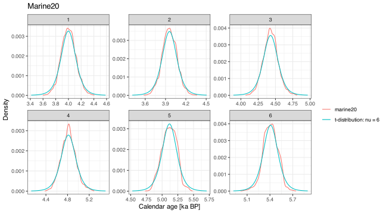
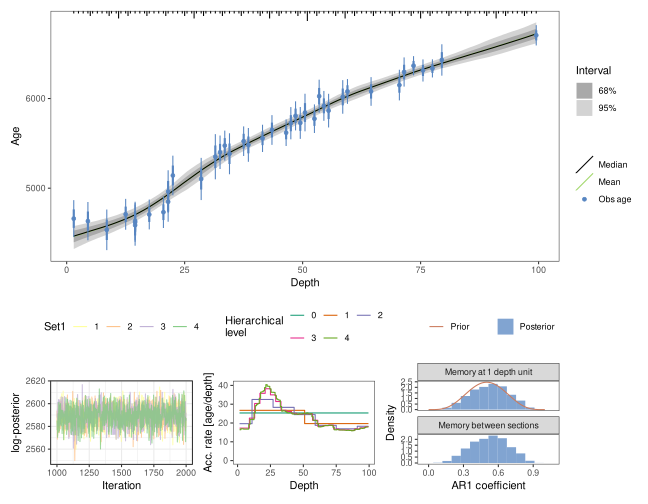
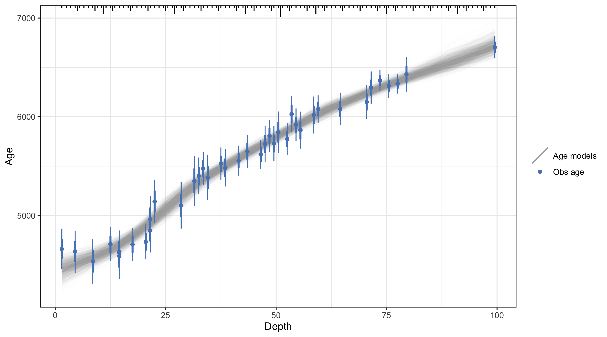
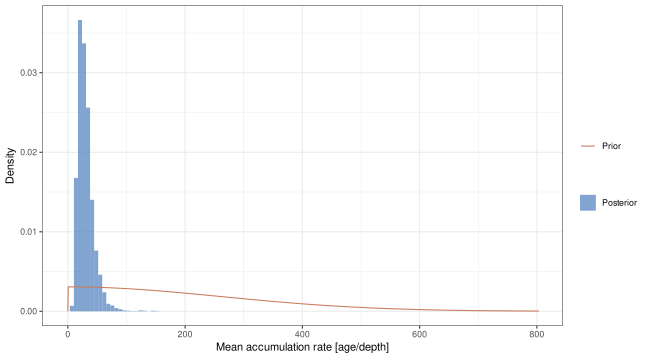
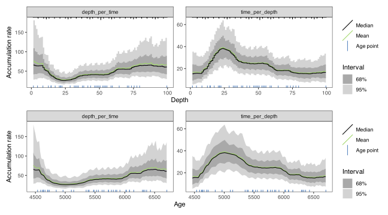
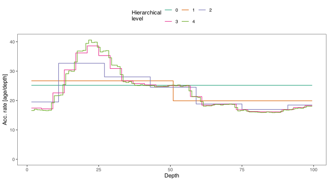
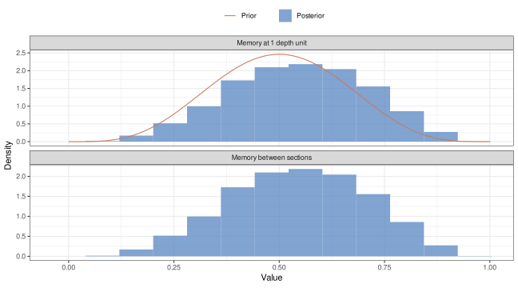
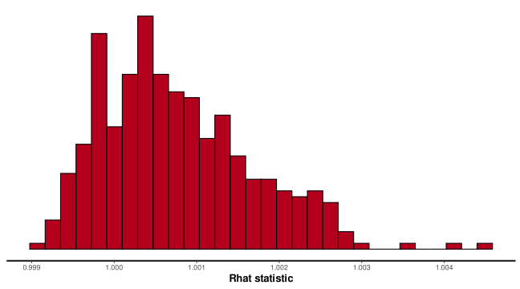
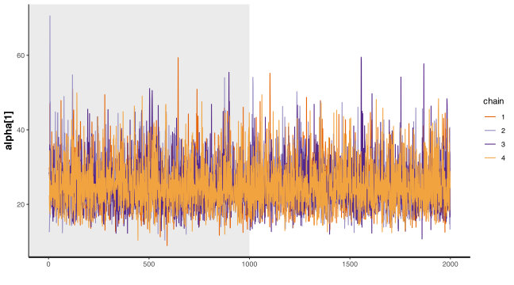

<!-- README.md is generated from README.Rmd. Please edit that file -->

# hamstr: Hierarchical Accumulation Modelling with Stan and R 

<!-- badges: start -->

[](https://codecov.io/gh/EarthSystemDiagnostics/hamstr)
[](https://github.com/EarthSystemDiagnostics/hamstr/actions/workflows/test-coverage.yaml)
[](https://github.com/EarthSystemDiagnostics/hamstr/actions/workflows/R-CMD-check.yaml)
<!-- badges: end -->

**hamstr** implements a *Bacon-like* (Blaauw and Christen, 2011)
sediment accumulation or age-depth model with hierarchically structured
multi-resolution sediment sections. The Bayesian model is implemented in
the Stan probabilistic programming language (<https://mc-stan.org/>).

## Installation

**hamstr** can be installed directly from Github

``` r
if (!require("remotes")) {
  install.packages("remotes")
}

remotes::install_github("earthsystemdiagnostics/hamstr", args = "--preclean", build_vignettes = FALSE)
```

## Using **hamstr**

Examples using the example core “MSB2K” from the
[rbacon](https://cran.r-project.org/web/packages/rbacon/index.html)
package.

``` r
library(hamstr)
library(rstan)

set.seed(20200827)
```

### Converting radiocarbon ages to calendar ages.

Unlike Bacon, **hamstr** does not do the conversion of radiocarbon dates
to calendar ages as part of the model fitting process. This must be done
in advance. **hamstr** includes the helper function `calibrate_14C_age`
to do this, which in turn uses the function `BchronCalibrate` from the
[Bchron](https://cran.r-project.org/web/packages/Bchron/index.html)
package.

Additionally, unlike Bacon, **hamstr** approximates the complex
empirical calendar age PDF that results from calibration into a single
point estimate and 1-sigma uncertainty. This is a necessary compromise
in order to be able to use the power of the Stan platform. Viewed in
context with the many other uncertainties in radiocarbon dates and the
resulting age-models this will not usually be a major issue.

The function `calibrate_14C_age` will append columns to a data.frame
with the calendar ages and 1-sigma uncertainties.

``` r
MSB2K_cal <- calibrate_14C_age(MSB2K, age.14C = "age", age.14C.se = "error")
```

The approximated calendar age PDFs can be compared with the empirical
PDFs with the function `compare_14C_PDF`

A sample of six dates are plotted here for the IntCal20 and Marine20
calibrations. This approximation is much less of an issue for marine
radiocarbon dates, as the cosmogenic radiocarbon signal has been
smoothed by mixing in the ocean.

``` r
i <- seq(1, 40, by = floor(40/6))[1:6]
compare_14C_PDF(MSB2K$age[i], MSB2K$error[i], cal_curve = "intcal20")+
  ggplot2::labs(title = "Intcal20")
```


``` r
compare_14C_PDF(MSB2K$age[i], MSB2K$error[i], cal_curve = "marine20") +
  ggplot2::labs(title = "Marine20")
```



### Fitting age-models with **hamstr**

Age-depth (sediment accumulation) models are fit with the function
`hamstr`. Vectors of depth, observed age and age uncertainty are passed
as arguments to `hamstr()`.

``` r
hamstr_fit_1 <- hamstr(depth = MSB2K_cal$depth,
                       obs_age = MSB2K_cal$age.14C.cal,
                       obs_err = MSB2K_cal$age.14C.cal.se, 
                       # the seed argument for the sampler is set here so that
                       # this example always returns the same numerical result
                       # you should not normally do this 
                       stan_sampler_args = list(seed = 1))
```

The default plotting method shows the fitted age models together with
some diagnostic plots: a traceplot of the log-posterior to assess
convergence of the overall model; a plot of accumulation rate against
depth at each hierarchical level; and the prior and posterior of the
memory parameter(s). By default the age-models are summarised to show
the mean, median, 68% and 95% posterior intervals (equivalent to 1- and
2-sigma uncertainty). The data are shown as points with their 1- and
2-sigma uncertainties. The structure of the sections is shown as tick
marks along the top of the age-model plot.

``` r
plot(hamstr_fit_1)
#> Scale for colour is already present.
#> Adding another scale for colour, which will replace the existing scale.
```



A “spaghetti” plot can be created instead of shaded regions. This shows
a random sample of iterations from the posterior distribution
(realisations of the age-depth model). This can be slow if lots of
iterations are plotted, the default is to plot 1000 iterations.
Additionally, plotting of the diagnostic plots can be switched off.

``` r
plot(hamstr_fit_1, summarise = FALSE, plot_diagnostics = FALSE)
```



#### Mean accumulation rate

There is no need to specify a prior value for the mean accumulation rate
(parameter `acc.mean` in Bacon) as in **hamstr**, this overall mean
accumulation rate is a full parameter estimated from the data.

By default, **hamstr** uses robust linear regression (`MASS::rlm`) to
estimate the mean accumulation rate from the data, and then uses this to
parametrise a prior distribution for the overall mean accumulation rate.
This prior is a half-normal with zero mean and standard deviation equal
to 10 times the estimated mean. Although this does introduce a slight
element of “double-dipping”, using the data twice (for both the prior
and likelihood), the resulting prior is only weakly-informative. The
advantage of this approach is that the prior is automatically scaled
appropriately regardless of the units of depth or age.

This prior can be checked visually against the posterior. The posterior
distribution should be much narrower than the weakly informative prior.

``` r
plot(hamstr_fit_1, type = "acc_mean_prior_post")
```



#### Other hyperparameters

`acc_shape`, the shape of the gamma distributed prior on accumulation
rates has a default value of 4 `acc_shape = 4`. The memory mean
`mem_mean = 0.5` and memory strength `mem_strength = 10`, are the same
as for Bacon \>= 2.5.1.

### Setting the number and hierarchical structure of the discrete sections

One of the more critical tuning parameters in the **Bacon** model is the
parameter `thick`, which determines the thickness and number of discrete
down-core sediment sections modelled. Finding a good or optimal value
for a given core is often critical to getting a good age-depth model.
Too few sections and the resulting age-model is very “blocky” and can
miss changes in sedimentation rate; however, counter-intuitively, too
many very thin sections can also often result in an age-model that
“under-fits” the data - a straight line through the age-control points
when a lower resolution model shows variation in accumulation rate.

The key structural difference between **Bacon** and **hamstr** models is
that with **hamstr** the sediment core is modelled at multiple
resolutions simultaneously - removing the need to trade-off smoothness
and flexibility. The resolutions have a hierarchical structure whereby
coarse resolution “parent” sections act as priors for higher resolution
“child” sections.

For **hamstr** version 0.8.0 and onwards, the parameter `K_fine`
controls the number of discrete sections at the highest resolution
level, while `K_factor` controls how much thicker the discrete sections
are at each subsequent level. Sufficient levels are modelled so that the
coarsest level has just one section - an overall mean accumulation rate.

The structure is hierarchical in the sense that the modelled
accumulation rates for the parent sections act as priors for their child
sections; specifically, the estimated accumulation rate for a coarse
parent section acts as the mean of the gamma prior for its child
sections. In turn, the overall mean accumulation rate for the whole core
is itself a parameter estimated by the fitting process. The hierarchical
structure of increasing resolution allows the model to adapt to
low-frequency changes in the accumulation rate, that is changes between
“regimes” of high or low accumulation that persist for long periods.

By default, the number of sections at the highest resolution (`K_fine`)
is set so that the sections have approximately unit thickness, i.e. if
the depths are in cm, the sections are 1 cm thick. This applies up to a
maximum of 900 sections above which the default remains 900 sections and
a coarser resolution is used. This can be changed from the default via
the parameter `K_fine`.

`K_factor` is set so that the total number of modelled sections is
approximately 1.2 times `K_fine`, or

`K_factor`^`K_factor` $\approx$ `K_tot` $\approx$ `1.2 * K_fine`

For a given shape parameter `acc_shape`, increasing the number of
modelled hierarchical levels increases the total variance in the
accumulation rates at the highest / finest resolution level. From
**hamstr** version 0.5.0 and onwards, the total variance is controlled
by modifying the shape parameter according to the number of hierarchical
levels.

### Getting the fitted age models

The fitted age models can be obtained with the `predict` and `summary`
methods. *iter* is the iteration of the sampler, or “realisation” of the
age model.

``` r
predict(hamstr_fit_1)
#> # A tibble: 396,000 × 3
#>     iter depth   age
#>    <int> <dbl> <dbl>
#>  1     1   1.5 4546.
#>  2     1   2.5 4553.
#>  3     1   3.5 4561.
#>  4     1   4.5 4570.
#>  5     1   5.5 4579.
#>  6     1   6.5 4588.
#>  7     1   7.5 4597.
#>  8     1   8.5 4609.
#>  9     1   9.5 4624.
#> 10     1  10.5 4641.
#> # ℹ 395,990 more rows
```

`summary` returns the age model summarised over the realisations.

``` r
summary(hamstr_fit_1)
#> # A tibble: 99 × 15
#>    depth   idx par         mean se_mean    sd `2.5%` `15.9%` `25%` `50%` `75%`
#>    <dbl> <dbl> <chr>      <dbl>   <dbl> <dbl>  <dbl>   <dbl> <dbl> <dbl> <dbl>
#>  1   1.5     1 c_ages[1]  4461.   1.48   65.6  4316.   4398. 4422. 4466. 4505.
#>  2   2.5     2 c_ages[2]  4477.   1.37   61.4  4343.   4419. 4440. 4482. 4520.
#>  3   3.5     3 c_ages[3]  4494.   1.26   57.8  4370.   4438. 4459. 4497. 4533.
#>  4   4.5     4 c_ages[4]  4511.   1.17   54.7  4394.   4459. 4477. 4515. 4548.
#>  5   5.5     5 c_ages[5]  4528.   1.07   52.1  4416.   4477. 4495. 4531. 4563.
#>  6   6.5     6 c_ages[6]  4544.   0.980  49.6  4439.   4496. 4514. 4547. 4579.
#>  7   7.5     7 c_ages[7]  4561.   0.894  47.4  4461.   4514. 4532. 4563. 4593.
#>  8   8.5     8 c_ages[8]  4578.   0.820  45.8  4484.   4531. 4549. 4579. 4609.
#>  9   9.5     9 c_ages[9]  4595.   0.760  44.3  4505.   4550. 4567. 4597. 4625.
#> 10  10.5    10 c_ages[10] 4615.   0.715  42.7  4528.   4572. 4587. 4616. 4643.
#> # ℹ 89 more rows
#> # ℹ 4 more variables: `84.1%` <dbl>, `97.5%` <dbl>, n_eff <dbl>, Rhat <dbl>
```

The hierarchical structure of the sections makes it difficult to specify
the exact depth resolution that you want for your resulting age-depth
model. The `predict` method takes an additional argument `depth` to
interpolate to a specific set of depths. The function returns NA for
depths that are outside the modelled depths.

``` r
age.mods.interp <- predict(hamstr_fit_1, depth = seq(0, 100, by = 1))
```

These interpolated age models can summarised with the same function as
the original fitted objects, but the n_eff and Rhat information is lost.

``` r
summary(age.mods.interp)
#> # A tibble: 101 × 10
#>    depth  mean    sd `2.5%` `15.9%` `25%` `50%` `75%` `84.1%` `97.5%`
#>    <dbl> <dbl> <dbl>  <dbl>   <dbl> <dbl> <dbl> <dbl>   <dbl>   <dbl>
#>  1     0  NaN   NA      NA      NA    NA    NA    NA      NA      NA 
#>  2     1  NaN   NA      NA      NA    NA    NA    NA      NA      NA 
#>  3     2 4469.  63.4  4328.   4408. 4432. 4474. 4512.   4531.   4581.
#>  4     3 4486.  59.5  4355.   4429. 4449. 4490. 4527.   4545.   4591.
#>  5     4 4503.  56.2  4382.   4449. 4468. 4506. 4541.   4558.   4603.
#>  6     5 4519.  53.3  4406.   4468. 4486. 4523. 4555.   4571.   4614.
#>  7     6 4536.  50.8  4428.   4487. 4504. 4539. 4571.   4586.   4627.
#>  8     7 4553.  48.4  4450.   4505. 4522. 4555. 4586.   4600.   4641.
#>  9     8 4569.  46.5  4475.   4523. 4540. 4571. 4601.   4615.   4655.
#> 10     9 4586.  45.0  4496.   4541. 4558. 4588. 4617.   4631.   4669.
#> # ℹ 91 more rows
```

### Getting and plotting the accumulation rate

The down-core accumulation rates are returned and plotted in both
depth-per-time, and time-per-depth units. If the input data are in years
and cm then the units will be cm/kyr and yrs/cm respectively. Note that
the acc_mean parameter in both **hamstr** and Bacon is parametrised in
terms of time per depth.

``` r
plot(hamstr_fit_1, type = "acc_rates")
#> Joining with `by = join_by(idx)`
#> Joining with `by = join_by(depth)`
```



``` r
summary(hamstr_fit_1, type = "acc_rates") 
#> Joining with `by = join_by(idx)`
#> # A tibble: 196 × 15
#>    depth c_depth_top c_depth_bottom acc_rate_unit   idx   tau  mean    sd `2.5%`
#>    <dbl>       <dbl>          <dbl> <chr>         <dbl> <dbl> <dbl> <dbl>  <dbl>
#>  1   1.5         1.5            2.5 depth_per_ti…     1     0  75.7  40.6   28.3
#>  2   2.5         2.5            3.5 depth_per_ti…     2     0  72.6  36.1   29.1
#>  3   3.5         3.5            4.5 depth_per_ti…     3     0  71.4  34.1   28.9
#>  4   4.5         4.5            5.5 depth_per_ti…     4     0  69.2  29.0   31.4
#>  5   5.5         5.5            6.5 depth_per_ti…     5     0  68.8  27.3   32.2
#>  6   6.5         6.5            7.5 depth_per_ti…     6     0  69.4  28.3   32.4
#>  7   7.5         7.5            8.5 depth_per_ti…     7     0  69.7  29.2   31.6
#>  8   8.5         8.5            9.5 depth_per_ti…     8     0  62.3  20.5   32.6
#>  9   9.5         9.5           10.5 depth_per_ti…     9     0  55.8  16.5   31.0
#> 10  10.5        10.5           11.5 depth_per_ti…    10     0  53.8  16.1   29.2
#> # ℹ 186 more rows
#> # ℹ 6 more variables: `15.9%` <dbl>, `25%` <dbl>, `50%` <dbl>, `75%` <dbl>,
#> #   `84.1%` <dbl>, `97.5%` <dbl>
```

### Diagnostic plots

Additional diagnostic plots are available. See ?plot.hamstr_fit for
options.

#### Plot modelled accumulation rates at each hierarchical level

``` r
plot(hamstr_fit_1, type = "hier_acc")
```



#### Plot memory prior and posterior

As for this example the highest resolution sections are approximately 1
cm thick, there is not much difference between R and w.

``` r
plot(hamstr_fit_1, type = "mem")
```



### Other `rstan` functions

Within the hamstr_fit object is an *rstan* object on which all the
standard rstan functions should operate correctly.

For example:

``` r
rstan::check_divergences(hamstr_fit_1$fit)
#> 0 of 4000 iterations ended with a divergence.

rstan::stan_rhat(hamstr_fit_1$fit)
#> `stat_bin()` using `bins = 30`. Pick better value with `binwidth`.
```



The first `alpha` parameter is the overall mean accumulation rate.

``` r
rstan::traceplot(hamstr_fit_1$fit, par = c("alpha[1]"),
                 inc_warmup = TRUE)
```



### References

- Blaauw, Maarten, and J. Andrés Christen. 2011. Flexible Paleoclimate
  Age-Depth Models Using an Autoregressive Gamma Process. Bayesian
  Analysis 6 (3): 457-74. <doi:10.1214/ba/1339616472>.

- Parnell, Andrew. 2016. Bchron: Radiocarbon Dating, Age-Depth
  Modelling, Relative Sea Level Rate Estimation, and Non-Parametric
  Phase Modelling. R package version 4.2.6.
  <https://CRAN.R-project.org/package=Bchron>

- Stan Development Team (2020). RStan: the R interface to Stan. R
  package version 2.21.2. <http://mc-stan.org/>.
