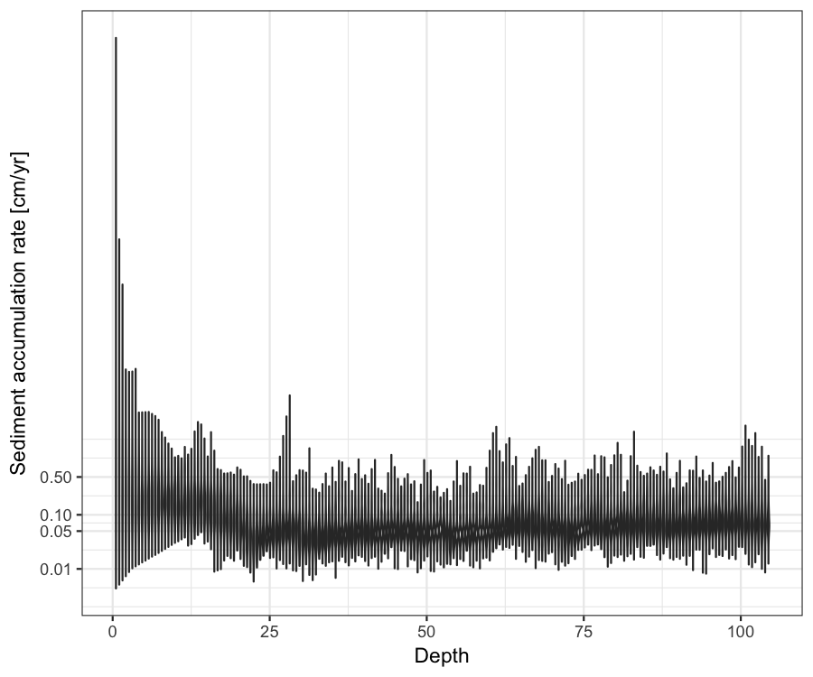

# baconr: An rstan implementation of the Bayesian Age-Depth model *Bacon* (Blaauw and Christen, 2011).

-------------------------------

**baconr** implements the Bayesian Age~Depth model, **Bacon**, in the **Stan** probabilistic programming language. It is at a very early stage of development and at the moment implements only the core non-Gaussian AR1 model described in Blaauw and Christen (2011). There is as yet no ability to convert between ^14^C ages and calibrated calendar ages.

There are currently just three exported functions: 

* `make_stan_dat` prepares data and parameter values into the correct format to be passed to the Stan model 
* `stan_bacon` calls a pre-compiled Stan implementation of Bacon and estimates the age model
* `plot_stan_bacon` plots a sample from the posterior distribution of the estimated age model

**baconr** also includes the example data, core MSB2K, included in the existing C++ implementation of [Bacon v2.2](http://www.chrono.qub.ac.uk/blaauw/bacon.html)

The motivation for creating this package is to make use of the Bacon age modelling routine more flexible, and to make further development 
of the age model itself easier, by coding it in a widely used higher-level probabilistic programming language.


*  Blaauw, Maarten, and J. Andrés Christen. 2011. Flexible Paleoclimate Age-Depth Models Using an Autoregressive Gamma Process. Bayesian Analysis 6 (3): 457-74. doi:10.1214/ba/1339616472.

*  Stan Development Team. 2016. Stan Modeling Language Users Guide and Reference Manual, Version 2.14.0.   http://mc-stan.org


## Installation

**baconr** can be installed directly from github


```r
if (!require("devtools")) {
  install.packages("devtools")
}

devtools::install_github("andrewdolman/baconr")
```


## Development

We aim to develop this package following the [Guidelines for R packages providing interfaces to Stan](https://cran.r-project.org/web/packages/rstantools/vignettes/developer-guidelines.html)


## Example


```r
library(baconr)
library(knitr)
library(ggplot2)
library(tidyr)
library(dplyr)

opts_chunk$set(echo=TRUE, message = FALSE, warning = FALSE, cache = TRUE,
               fig.width = 6, fig.pos = "H", dpi = 150, autodep = TRUE)
```

### Data and parameters

the output from `make_stan_dat` is shown here to illustrate the required data and parameter format, but a separate call to `make_stan_dat` is not normally necessary as it is used internally by `stan_bacon`


```r
# Get number of sections K, so that they will be ~ 5cm
K_for_5cm <- round(diff(range(MSB2K$depth)) / 5)

make_stan_dat(depth = MSB2K$depth, 
  obs_age = MSB2K$age, 
  obs_err = MSB2K$error,
  K = K_for_5cm, nu = 6,
  acc_mean = 20, acc_alpha = 1.5,
  mem_mean = 0.7, mem_strength = 4)
```

```
## $depth
##  [1]  1.5  4.5  8.5 12.5 14.5 14.5 14.5 17.5 20.5 21.5 21.5 22.5 28.5 31.5
## [15] 32.5 33.5 34.5 37.5 38.5 41.5 43.5 46.5 47.5 48.5 49.5 50.5 52.5 53.5
## [29] 54.5 55.5 58.5 59.5 64.5 70.5 71.5 73.5 75.5 77.5 79.5 99.5
## 
## $obs_age
##  [1] 4128 4106 4046 4184 4076 4107 4097 4177 4220 4281 4374 4493 4452 4616
## [15] 4662 4743 4638 4810 4757 4839 4913 4880 4989 5070 4993 5115 5026 5242
## [29] 5159 5130 5238 5293 5293 5368 5498 5588 5514 5535 5644 5885
## 
## $obs_err
##  [1] 65 60 59 58 62 61 58 53 59 64 64 62 52 64 64 67 67 67 82 59 65 57 70
## [24] 66 67 79 51 64 50 66 65 38 54 51 69 55 57 52 77 45
## 
## $K
## [1] 20
## 
## $nu
## [1] 6
## 
## $acc_mean
## [1] 20
## 
## $acc_alpha
## [1] 1.5
## 
## $mem_mean
## [1] 0.7
## 
## $mem_strength
## [1] 4
## 
## $N
## [1] 40
## 
## $acc_beta
## [1] 0.075
## 
## $mem_alpha
## [1] 2.8
## 
## $mem_beta
## [1] 1.2
## 
## $c
##  [1]  1  2  3  4  5  6  7  8  9 10 11 12 13 14 15 16 17 18 19 20
## 
## $delta_c
## [1] 5.22
## 
## $c_depth_bottom
##  [1]   5.22  10.44  15.66  20.88  26.10  31.32  36.54  41.76  46.98  52.20
## [11]  57.42  62.64  67.86  73.08  78.30  83.52  88.74  93.96  99.18 104.40
## 
## $c_depth_top
##  [1]  0.00  5.22 10.44 15.66 20.88 26.10 31.32 36.54 41.76 46.98 52.20
## [12] 57.42 62.64 67.86 73.08 78.30 83.52 88.74 93.96 99.18
## 
## $which_c
##  [1]  1  1  2  3  3  3  3  4  4  5  5  5  6  7  7  7  7  8  8  8  9  9 10
## [24] 10 10 10 11 11 11 11 12 12 13 14 14 15 15 15 16 20
```


### Fit the bacon model with `stan_bacon`


```r
fit <- stan_bacon(
  depth = MSB2K$depth, 
  obs_age = MSB2K$age, 
  obs_err = MSB2K$error,
  K = K_for_5cm, nu = 6,
  acc_mean = 20, acc_alpha = 1.5,
  mem_mean = 0.7, mem_strength = 4,
  iter = 2000, chains = 4)
```

```
## 
## SAMPLING FOR MODEL 'bacon' NOW (CHAIN 1).
## 
## Gradient evaluation took 0 seconds
## 1000 transitions using 10 leapfrog steps per transition would take 0 seconds.
## Adjust your expectations accordingly!
## 
## 
## Iteration:    1 / 2000 [  0%]  (Warmup)
## Iteration:  200 / 2000 [ 10%]  (Warmup)
## Iteration:  400 / 2000 [ 20%]  (Warmup)
## Iteration:  600 / 2000 [ 30%]  (Warmup)
## Iteration:  800 / 2000 [ 40%]  (Warmup)
## Iteration: 1000 / 2000 [ 50%]  (Warmup)
## Iteration: 1001 / 2000 [ 50%]  (Sampling)
## Iteration: 1200 / 2000 [ 60%]  (Sampling)
## Iteration: 1400 / 2000 [ 70%]  (Sampling)
## Iteration: 1600 / 2000 [ 80%]  (Sampling)
## Iteration: 1800 / 2000 [ 90%]  (Sampling)
## Iteration: 2000 / 2000 [100%]  (Sampling)
## 
##  Elapsed Time: 1.922 seconds (Warm-up)
##                1.268 seconds (Sampling)
##                3.19 seconds (Total)
## 
## 
## SAMPLING FOR MODEL 'bacon' NOW (CHAIN 2).
## 
## Gradient evaluation took 0 seconds
## 1000 transitions using 10 leapfrog steps per transition would take 0 seconds.
## Adjust your expectations accordingly!
## 
## 
## Iteration:    1 / 2000 [  0%]  (Warmup)
## Iteration:  200 / 2000 [ 10%]  (Warmup)
## Iteration:  400 / 2000 [ 20%]  (Warmup)
## Iteration:  600 / 2000 [ 30%]  (Warmup)
## Iteration:  800 / 2000 [ 40%]  (Warmup)
## Iteration: 1000 / 2000 [ 50%]  (Warmup)
## Iteration: 1001 / 2000 [ 50%]  (Sampling)
## Iteration: 1200 / 2000 [ 60%]  (Sampling)
## Iteration: 1400 / 2000 [ 70%]  (Sampling)
## Iteration: 1600 / 2000 [ 80%]  (Sampling)
## Iteration: 1800 / 2000 [ 90%]  (Sampling)
## Iteration: 2000 / 2000 [100%]  (Sampling)
## 
##  Elapsed Time: 1.876 seconds (Warm-up)
##                1.357 seconds (Sampling)
##                3.233 seconds (Total)
## 
## 
## SAMPLING FOR MODEL 'bacon' NOW (CHAIN 3).
## 
## Gradient evaluation took 0 seconds
## 1000 transitions using 10 leapfrog steps per transition would take 0 seconds.
## Adjust your expectations accordingly!
## 
## 
## Iteration:    1 / 2000 [  0%]  (Warmup)
## Iteration:  200 / 2000 [ 10%]  (Warmup)
## Iteration:  400 / 2000 [ 20%]  (Warmup)
## Iteration:  600 / 2000 [ 30%]  (Warmup)
## Iteration:  800 / 2000 [ 40%]  (Warmup)
## Iteration: 1000 / 2000 [ 50%]  (Warmup)
## Iteration: 1001 / 2000 [ 50%]  (Sampling)
## Iteration: 1200 / 2000 [ 60%]  (Sampling)
## Iteration: 1400 / 2000 [ 70%]  (Sampling)
## Iteration: 1600 / 2000 [ 80%]  (Sampling)
## Iteration: 1800 / 2000 [ 90%]  (Sampling)
## Iteration: 2000 / 2000 [100%]  (Sampling)
## 
##  Elapsed Time: 1.916 seconds (Warm-up)
##                1.22 seconds (Sampling)
##                3.136 seconds (Total)
## 
## 
## SAMPLING FOR MODEL 'bacon' NOW (CHAIN 4).
## 
## Gradient evaluation took 0 seconds
## 1000 transitions using 10 leapfrog steps per transition would take 0 seconds.
## Adjust your expectations accordingly!
## 
## 
## Iteration:    1 / 2000 [  0%]  (Warmup)
## Iteration:  200 / 2000 [ 10%]  (Warmup)
## Iteration:  400 / 2000 [ 20%]  (Warmup)
## Iteration:  600 / 2000 [ 30%]  (Warmup)
## Iteration:  800 / 2000 [ 40%]  (Warmup)
## Iteration: 1000 / 2000 [ 50%]  (Warmup)
## Iteration: 1001 / 2000 [ 50%]  (Sampling)
## Iteration: 1200 / 2000 [ 60%]  (Sampling)
## Iteration: 1400 / 2000 [ 70%]  (Sampling)
## Iteration: 1600 / 2000 [ 80%]  (Sampling)
## Iteration: 1800 / 2000 [ 90%]  (Sampling)
## Iteration: 2000 / 2000 [100%]  (Sampling)
## 
##  Elapsed Time: 1.868 seconds (Warm-up)
##                1.3 seconds (Sampling)
##                3.168 seconds (Total)
```


```r
options(width = 85)
print(fit$fit, par = c("c_ages"))
```

```
## Inference for Stan model: bacon.
## 4 chains, each with iter=2000; warmup=1000; thin=1; 
## post-warmup draws per chain=1000, total post-warmup draws=4000.
## 
##               mean se_mean    sd    2.5%     25%     50%     75%   97.5% n_eff Rhat
## c_ages[1]  4044.25    0.61 38.42 3962.28 4020.19 4046.65 4071.36 4112.12  4000    1
## c_ages[2]  4073.57    0.49 31.20 4009.78 4053.62 4074.74 4094.94 4131.36  4000    1
## c_ages[3]  4108.31    0.44 27.74 4053.39 4089.85 4108.71 4127.15 4161.73  4000    1
## c_ages[4]  4158.40    0.46 29.07 4102.03 4138.88 4158.53 4177.60 4217.85  4000    1
## c_ages[5]  4291.07    0.54 34.45 4224.10 4268.22 4291.01 4314.45 4360.43  4000    1
## c_ages[6]  4437.79    0.78 49.50 4335.20 4407.92 4440.44 4469.05 4534.60  4000    1
## c_ages[7]  4601.66    0.53 33.27 4536.58 4579.81 4601.45 4622.84 4668.67  4000    1
## c_ages[8]  4741.00    0.52 32.97 4675.24 4719.78 4740.38 4761.83 4808.33  4000    1
## c_ages[9]  4857.01    0.49 31.17 4793.04 4837.44 4857.77 4877.68 4915.42  4000    1
## c_ages[10] 4971.08    0.49 31.13 4904.03 4951.94 4973.37 4992.25 5027.51  4000    1
## c_ages[11] 5096.33    0.47 29.91 5033.73 5077.49 5097.49 5115.53 5153.43  4000    1
## c_ages[12] 5215.49    0.43 27.00 5164.32 5197.03 5215.49 5232.42 5272.10  4000    1
## c_ages[13] 5304.85    0.49 30.88 5243.60 5284.78 5304.56 5324.49 5367.91  4000    1
## c_ages[14] 5388.93    0.58 36.88 5309.26 5366.40 5391.28 5413.97 5456.14  4000    1
## c_ages[15] 5490.14    0.47 29.98 5430.68 5470.89 5490.42 5510.09 5548.25  4000    1
## c_ages[16] 5572.58    0.51 32.44 5509.72 5550.68 5572.29 5593.56 5637.20  4000    1
## c_ages[17] 5653.50    0.72 45.35 5567.25 5623.83 5652.58 5681.75 5748.71  4000    1
## c_ages[18] 5730.49    0.81 51.32 5630.97 5697.70 5729.92 5762.43 5835.43  4000    1
## c_ages[19] 5808.12    0.80 50.87 5706.32 5776.85 5808.18 5839.83 5909.57  4000    1
## c_ages[20] 5889.55    0.75 47.19 5800.34 5859.71 5887.08 5917.57 5989.11  4000    1
## c_ages[21] 5983.50    1.14 72.38 5863.23 5935.16 5977.91 6023.48 6150.32  4000    1
## 
## Samples were drawn using NUTS(diag_e) at Sun Oct 01 17:44:10 2017.
## For each parameter, n_eff is a crude measure of effective sample size,
## and Rhat is the potential scale reduction factor on split chains (at 
## convergence, Rhat=1).
```


### Plot the estimated age model


```r
set.seed(20170406)
plot_stan_bacon(fit, 100)
```

<!-- -->


### Fit again at higher vertical resolution and with more variable accumulation rates


```r
fit2 <- stan_bacon(
  depth = MSB2K$depth, 
  obs_age = MSB2K$age, 
  obs_err = MSB2K$error,
  K = K_for_5cm*10, nu = 6,
  acc_mean = 20, acc_alpha = 0.2,
  mem_mean = 0.7, mem_strength = 4,
  iter = 2000, chains = 4)
```


```r
plot_stan_bacon(fit2, 100)
```

<!-- -->


### Distribution of sediment accumulation rates


```r
age.fit <- fit2
age.mod <- rstan::extract(age.fit$fit)

bp.dat <- age.mod$x[1:100,] %>% 
  as_tibble() %>% 
  tibble::rownames_to_column("Rep") %>% 
  gather(Depth, value, -Rep) %>% 
  mutate(Depth = as.numeric(gsub("V", "", Depth)),
         Depth = Depth * age.fit$data$delta_c,
         Rep = as.numeric(Rep))

bp.dat %>% 
  ggplot(aes(x = Depth, y = 1/value, group = Depth)) + 
  geom_violin() +
  #geom_boxplot() +
  #geom_point(alpha = 0.15)
  scale_y_continuous("Sediment accumulation rate [cm/yr]",
                     trans = "log10", breaks = c(0.01, 0.05, 0.1, 0.5)) +
  expand_limits(y = 0.01) + 
  theme_bw()
```

<!-- -->


